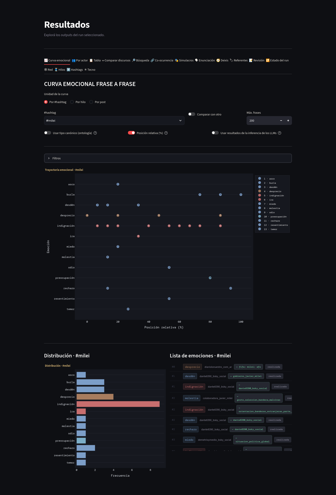
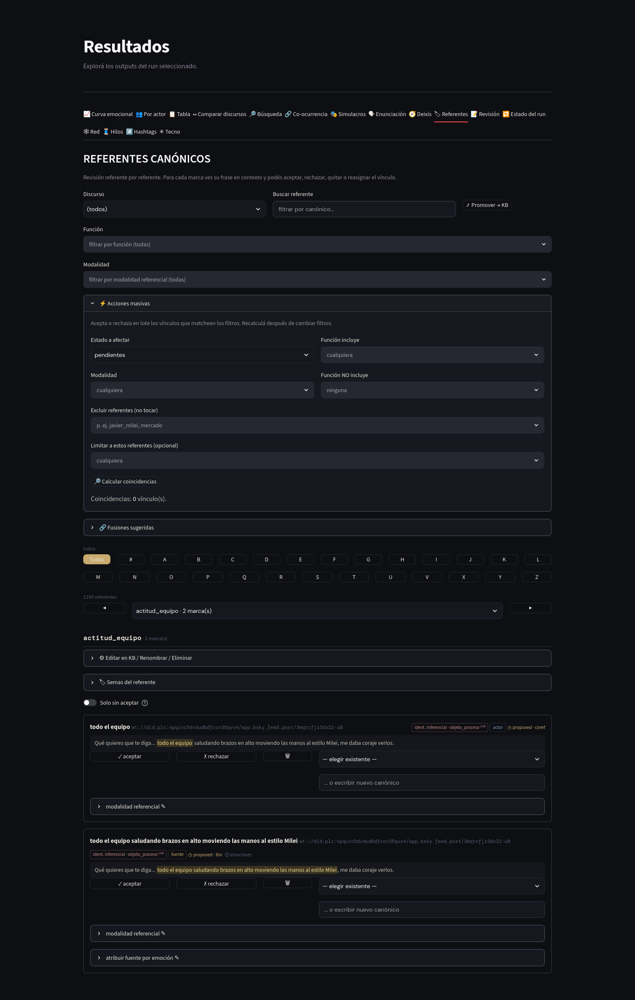
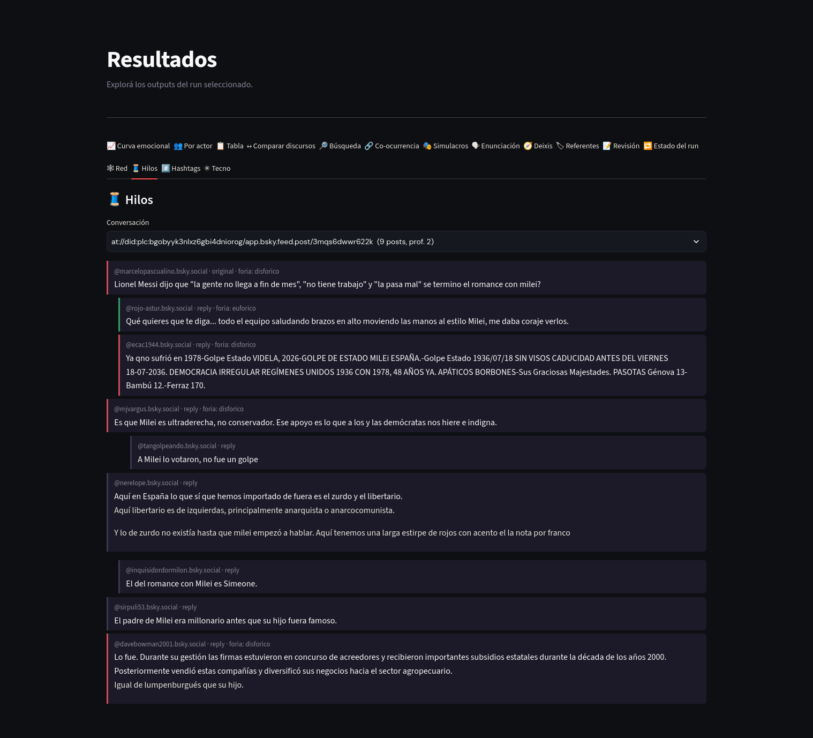
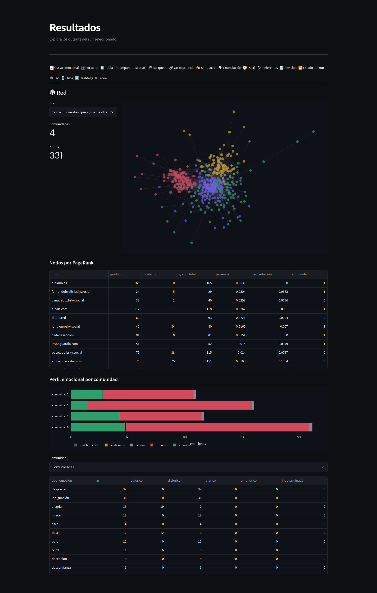

# EmoParse v0.6.5

> Análisis de emociones en discursos con modelos de lenguaje locales.

EmoParse procesa corpus de discursos y devuelve, para cada frase, una caracterización semiótica de las emociones que la atraviesan: qué actor las experimenta, en qué modo de existencia, con qué foria (la orientación entre lo agradable y lo desagradable), dominancia, intensidad, duración, temporalidad histórica y aspecto gramatical, y cuál es la fuente que la desencadena. Opcionalmente realiza un análisis actancial de cada emoción (mediador, verificadores normativo y observacional, operador de modificación y polaridad) y homogeneiza actores y emociones para habilitar el análisis agregado del corpus.

Además del discurso tradicional, EmoParse analiza **discurso nativo digital**: el género `tuit` trata cada post como enunciado compuesto (texto + hashtags + menciones + emojis + tecnografismos + imágenes), preserva la estructura conversacional y agrega análisis de redes de interacción con acoplamiento emocional. Ver [Género tuit](#género-tuit-discurso-nativo-digital).

Está pensado para investigadores en lingüística, semiótica, ciencias del lenguaje y análisis del discurso que necesitan procesar corpus extensos sin renunciar a la trazabilidad ni al marco teórico.

- **Reproducible**: una base de resultados por corrida, versionado fino de prompts y ontologías, semilla fija.
- **Trazable**: cada emoción detectada lleva su justificación textual y queda enlazada a la frase original.
- **Local-first**: corre con modelos GGUF locales (llama.cpp) o vía LM Studio, sin enviar el corpus a ningún servicio externo. La arquitectura admite además backends de API.
- **Extensible**: el pipeline (la cadena de etapas del análisis) está organizado como un grafo declarativo; sumar géneros, fuentes de adquisición o agentes es código aislado.



*Curva emocional de un discurso, con las emociones ordenadas por foria dominante.*

---

> 📖 **[Documentación completa (v0.6.4) →](https://alexdcolman.github.io/EmoParse/)**

---

## Requisitos

- Python 3.11+
- git
- GPU recomendada (la placa de video, que acelera mucho el análisis; NVIDIA con CUDA, AMD con ROCm). Sin ella el programa funciona, más lento.

---

## Instalación

```bash
git clone https://github.com/alexdcolman/EmoParse.git
cd EmoParse

python -m venv .venv
source .venv/bin/activate   # Linux/macOS
# .venv\Scripts\activate    # Windows

# Instalación con backend local + dashboard + scraping
pip install -e ".[llamacpp,ui,scraping]"
```

Los extras disponibles son `llamacpp`, `lmstudio`, `ui`, `nlp`, `scraping`, `scraping_selenium`, `bluesky` (adquisición de posts vía AT Protocol; Mastodon no requiere extra), `techno` (parsing de emojis con secuencias compuestas), `network` (análisis de redes), `embeddings` (agrupamiento semántico de textos), `analytics`, `agents`, `data`, `utils`, `dev` y `all`. Ver el detalle en la documentación.

La etapa `modalidad` usa spaCy (extra `nlp`) y un modelo en español; instalalo una vez con:

```bash
pip install -e ".[nlp]"
python -m spacy download es_core_news_md
```

> Una imagen Docker oficial está en preparación.

---

## Quickstart

```bash
# 1. Copiar el config de ejemplo y ajustarlo
cp config.example.yaml config.yaml

# 2. Bajar al menos un modelo GGUF a models/
#    (ver la documentación para recomendaciones)

# 3. Correr el pipeline sobre un CSV de discursos
emoparse run \
  --config config.yaml \
  --input  data/discursos.csv \
  --run-id mi_run

# 4. Explorar resultados
emoparse app
```

El input mínimo es un CSV con columnas `codigo` (identificador único) y `contenido` (texto). EmoParse también incluye un scraper para Casa Rosada:

```bash
emoparse scrape --source casarosada \
  --out data/discursos.csv \
  --from 2024-01-01 --to 2024-12-31
```

---

## Comandos disponibles

```
emoparse app         Abre el dashboard de revisión y visualización
emoparse run         Ejecuta el pipeline completo
emoparse scrape      Scrapea discursos desde una source registrada
emoparse acquire     Adquiere posts (Bluesky, Mastodon, dumps JSONL/CSV) a un corpus incremental
emoparse follows     Adquiere el grafo de seguimiento entre las cuentas del corpus
emoparse network     Construye y analiza las redes de un run (interacción, similitud, semántica)
emoparse eval        Evaluación de validez: golden sets, acuerdo inter-anotador, controles
emoparse status      Resumen pending/failed/completed por stage
emoparse inspect     Estado completo de un discurso particular
emoparse retry       Limpia errores para reintentar
emoparse validate    Corre los validadores semióticos sobre las emociones
emoparse modalidad   Clasifica la modalidad referencial de los vínculos (sin LLM)
emoparse semas       Mantenimiento de semas de referentes canónicos
emoparse judge       Resumen de veredictos del segundo modelo
emoparse metrics     Métricas persistidas por stage
emoparse stats       Estadísticas del cache
emoparse export      Exporta las tablas a CSV
```

Todos aceptan `--help`.

---

## Foco de análisis, referentes y deixis

Por defecto `emoparse run` detecta emociones de todos los experienciadores. Para acotar el análisis a ciertos roles, `run` acepta `--enunciador`, `--enunciatarios` y `--actores` (combinables).

Las marcas discursivas de actores, experienciadores y fuentes se agrupan en una base de menciones y se vinculan a **referentes canónicos** (la unidad bajo la cual convergen las distintas expresiones que remiten a lo mismo: "el presidente", "Milei", "el jefe de Estado"). El agrupamiento es automático y conservador (correferencia léxica, inferencia dominante del modelo, deixis de 1ª persona y match contra una base de referentes conocidos), de modo que es preferible que queden casi-duplicados sin unir antes que fusionar dos referentes distintos. La revisión humana (agrupar, aceptar, reasignar, mergear, asignar semas) vive en la tab **Referentes**.

Una emoción nunca agrupa dos o más experienciadores: si más de un actor la experimenta, se desdobla en una emoción por experienciador, cada una con su propio modo de existencia. La **fuente**, en cambio, puede combinar entidades sin multiplicar simulacros: "libertarios, radicales y macristas" desencadena una sola indignación con sus tres referentes resueltos juntos. Esa resolución vive en un único módulo que comparten el pipeline, el dashboard y el export.

Para revisar a escala, la tab **Referentes** incluye **acciones masivas** (aceptar/rechazar en lote filtrando por estado, modalidad, función y referentes) y **fusiones sugeridas**: un detector de casi-duplicados por bloques y similitud léxica, opcionalmente semántica, que propone grupos para fusionar con revisión humana, sin pasar toda la base por un modelo de lenguaje.



La etapa `enunciation` resuelve el enunciador antes del análisis principal: en géneros clásicos, un sub-paso con prompt mínimo devuelve su denominación normalizada ("el presidente Javier Milei" → "Javier Milei"); en el género `tuit` el enunciador es la cuenta autora del post, sin inferencia. Con el enunciador fijado, el prompt principal identifica enunciatarios, auditorio y colectivos de identificación, siempre como referentes concretos y nunca como etiquetas de rol. Una base persistida (`knowledge/enunciacion_kb.json`) acumula el repertorio conocido de cada enunciador y entra como contexto en corridas futuras, con libertad del modelo para proponer identificaciones nuevas.

La etapa opcional `deixis` resuelve las marcas de 1ª y 2ª persona ("yo", "nosotros", "veamos") a los referentes concretos identificados por `enunciation`, con asignación posiblemente múltiple. Sus sugerencias se revisan en la tab **Deixis**, que las inscribe en la marca sin decidir por sí sola: como una marca pertenece a toda la unidad, qué referente rige cada simulacro se decide por emoción y por rol.

La etapa opcional `modalidad` clasifica **cómo** cada marca refiere a su referente: `designacion` (lo nombra: "Javier Milei", "el presidente"), `referencia_gramatical` (deixis o morfología: "yo", "he defendido") o `identificacion_inferencial` (lo identifica por la actitud o los valores que expresa). Es un híbrido: un pre-pass con spaCy resuelve los casos claros y el modelo interviene solo en los ambiguos. Así se puede aceptar un vínculo sin perder el experienciador y a la vez filtrar las designaciones para estudiar la construcción de objetos de discurso.

El dashboard incluye además tabs de **Búsqueda** (por texto o por selección de emoción/actor/experienciador/fuente), **Co-ocurrencia** de emociones y **Simulacros** (reconstrucción de cada emoción con sus funciones actanciales).

---

## Género tuit (discurso nativo digital)

El género `tuit` adapta el marco a posts de redes sociales, donde el texto es un **tecnodiscurso**: los hashtags, menciones, emojis, alargamientos y mayúsculas son materia enunciativa a analizar. El principio del subsistema es anotar sin borrar: el texto nunca se altera y cada elemento se extrae con sus offsets a una tabla aparte.

```bash
# 1. Adquirir un corpus (Bluesky o Mastodon; también importa dumps JSONL o CSV)
emoparse acquire --source bluesky --query "#tarifazo" --lang es \
    --max 500 --out data/tarifazo.jsonl

# 2. Analizarlo
emoparse run --config config.yaml --genre tuit \
    --input data/tarifazo.jsonl --run-id tarifazo01

# 3. Redes de interacción
emoparse network --db runs/tarifazo01.sqlite --export-dir exports/red
```

Qué agrega el género respecto del pipeline clásico:

- **`technoparse`** (determinista, sin modelo): extrae hashtags, @menciones, URLs, emojis y tecnografismos con offsets. Cada @handle siembra un referente canónico con vínculo aceptado, poblando la base de menciones antes de cualquier inferencia.
- **Contexto conversacional**: cada post se analiza junto al post que abrió la conversación y a los que responde, como contexto de desambiguación y no como fuente de emociones. Los hilos se reconstruyen en la ingesta.
- **`reframing`**: clasifica la operación de citas y reposts con comentario (adhesión / ironía-distancia / denuncia / difusión neutra) y qué hace el citador con el afecto que pone a circular (lo asume, lo semiotiza o no lo retoma), para no atribuirle a quien denuncia la euforia que exhibe. Lo clasificado es siempre una operación del citador, que sí está en el corpus, y no una propiedad del citado, que puede no estarlo. Cuando el citado ya fue analizado, recibe su inventario emocional en lugar de reinferirlo; cuando no está en el corpus, lee la copia que el propio citador trae en su payload. Cada clasificación registra sobre qué evidencia se hizo. Corre con una unidad por llamada al modelo, no en lotes.
- **`emoji_affect`**: un léxico curado resuelve los emojis inequívocos sin modelo; los ambiguos (😂 ¿risa o burla?) se desambiguan en contexto. La unidad es la racha, no la pulsación: 🤣🤣🤣 es un gesto intensificado y se resuelve una vez, mientras que dos apariciones separadas del mismo emoji son usos distintos y se resuelven por separado.
- **`hashtag_semiotics`**: analiza el funcionamiento de cada hashtag en cada post donde aparece (tópico / afiliación-consigna / evaluativo / irónico / campaña), con su acoplamiento y la foria de ese uso; la caracterización a nivel corpus se deriva por agregación.
- **`tecno_usage`**: caracteriza el uso pragmático de cada @mención (interpelar, confrontar, exponer, citar, agradecer, convocar, marcar afiliación), de cada tecnografismo (énfasis, grito, ironía, celebración, rótulo temático, reticencia) y de cada URL (fuente/prueba, autopromoción, convocatoria, enlace temático).
- **Enunciación anclada al dispositivo**: el enunciador es la cuenta autora y el auditorio se construye de forma determinista (seguidores, un auditorio por hashtag, un destinatario por mención). Los roles enunciativos dependen del tipo de discurso que resuelve `metadata`: pro/para/contradestinatario (Verón) en el político, lector-ciudadano / instancia-blanco / fuente-referente (Charaudeau) en el periodístico, y tríadas análogas en institucional, humor/meme, personal-cotidiano y promocional. A ellos se suman dos posiciones transversales del dispositivo: destinatario mencionado y audiencia ambiente.
- **`vision_describe`** (opcional): describe las imágenes adjuntas con un modelo de visión y esa descripción entra como contexto del análisis emocional.
- **Ontología ampliada**: emociones del discurso político en redes (burla, hartazgo, vergüenza ajena, diversión) restringidas por género sobre una base compartida.



**Redes.** `emoparse network` construye los grafos de interacción (reply, mención, RT, cita, co-hashtag), calcula métricas por nodo y comunidades (con semilla fija, reproducible), los acopla al análisis emocional y exporta a GEXF para Gephi. El acoplamiento incluye perfiles fóricos por comunidad, matrices de transición fórica padre→respuesta y, con `--flujo`, el contagio por tipo de emoción y la transición partida intra/inter comunidad. Con `--similitud` agrupa los simulacros por parecido entre sus componentes y con `--semantico` agrupa los posts por contenido; ambos valen para cualquier género, así que también sirven para corpus de discursos. `emoparse follows` adquiere aparte el grafo de seguimiento entre las cuentas del corpus.



**Dashboard.** Cuando el run contiene posts aparecen las tabs 🧵 Hilos y citas (el árbol conversacional con la foria de cada post y el citado embebido, más una vista de todas las citas y reposts del corpus con su operación de redocumentación), 🕸 Red, #️⃣ Hashtags (distribución de funciones y drill-down por uso) y ✳ Tecno (usos en contexto de menciones, tecnografismos y links, y frases por emoji). Una sección **⚙ Ejecutar** arma los comandos de CLI desde controles, para copiar y pegar. Las tabs generales se adaptan: la curva emocional se ve por defecto como evolución de la conversación pública, la co-ocurrencia y la timeline se filtran por hilo o hashtag, y la revisión muestra cada post con sus tecnolingüísticos y su media. En todo el dashboard el color codifica la foria (verde petróleo eufórica, rojo ladrillo disfórica, ocre ambifórica, gris oliva afórica), con una leyenda fija que lo recuerda.

La adquisición respeta los términos de cada plataforma e incluye seudonimización opcional (`--pseudonymize`) con alias estables que preservan la estructura de hilos y redes. Ver `src/emoparse/acquisition/README.md` para las consideraciones éticas.

---

## Evaluación de validez

`emoparse eval` implementa el circuito de validación: exportar una muestra estratificada para **anotación humana a ciegas** (`--make-sample`), calcular el **acuerdo inter-anotador** con alpha de Krippendorff (`--agreement`, implementación propia verificada contra los valores publicados), construir un **golden set** de regresión y comparar cada run contra él (`--golden`: precisión/recall/F1 de detección más accuracy por dimensión), y medir la **sobre-detección** sobre corpus de control sin carga emocional (`--control`). El manual de anotación vive en `evals/manual_anotacion.md`; el protocolo convierte cada cambio de prompt u ontología en un experimento medible.

---

## Estado del proyecto

EmoParse está en **beta**. La arquitectura es estable; las ontologías y heurísticas semióticas (en `knowledge/`) se siguen refinando. Reportes de issues y pull requests son bienvenidos.

---

## Licencia

[MIT](https://github.com/alexdcolman/EmoParse/blob/main/LICENSE).

Si lo usás en una publicación académica, una referencia al repositorio es bienvenida y ayuda a sostener el proyecto.

---

## Autoría

Este proyecto fue desarrollado en el marco de una investigación sobre análisis automático de emociones en discursos por:

- **[Alex Colman](https://independent.academia.edu/AlexColman1)**

Para dudas o colaboraciones, podés contactarme vía GitHub o correo: alexdcolman@gmail.com

---

## Agradecimientos

Agradezco especialmente a [Mathi Gatti](https://mathigatti.com/) y a [Martín Schuster](https://www.flacso.org.ar/docentes/schuster-martin-ivan/) por la orientación en el desarrollo del proyecto.

[Laura Bonilla](https://www.researchgate.net/profile/Laura-Bonilla-Neira) me está ayudando a desarrollar la adaptación de EmoParse para análisis de tuits (género `tuit`).

---

## ¿Querés colaborar?

Pull requests, issues o sugerencias son bienvenidas.
