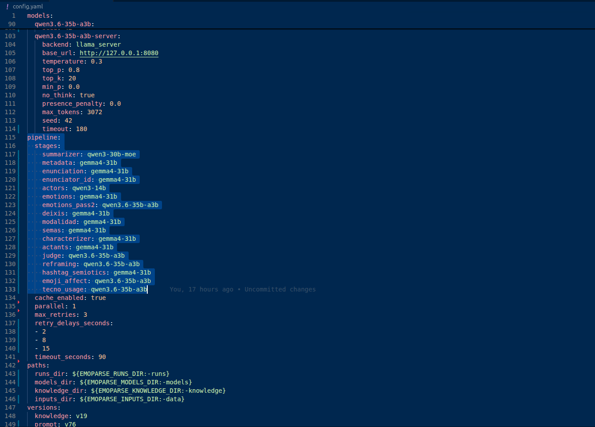
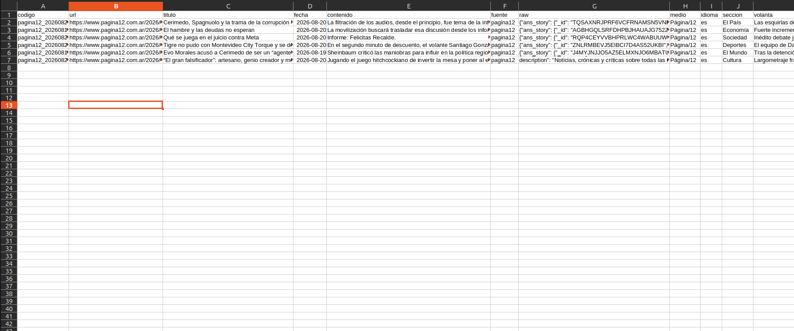
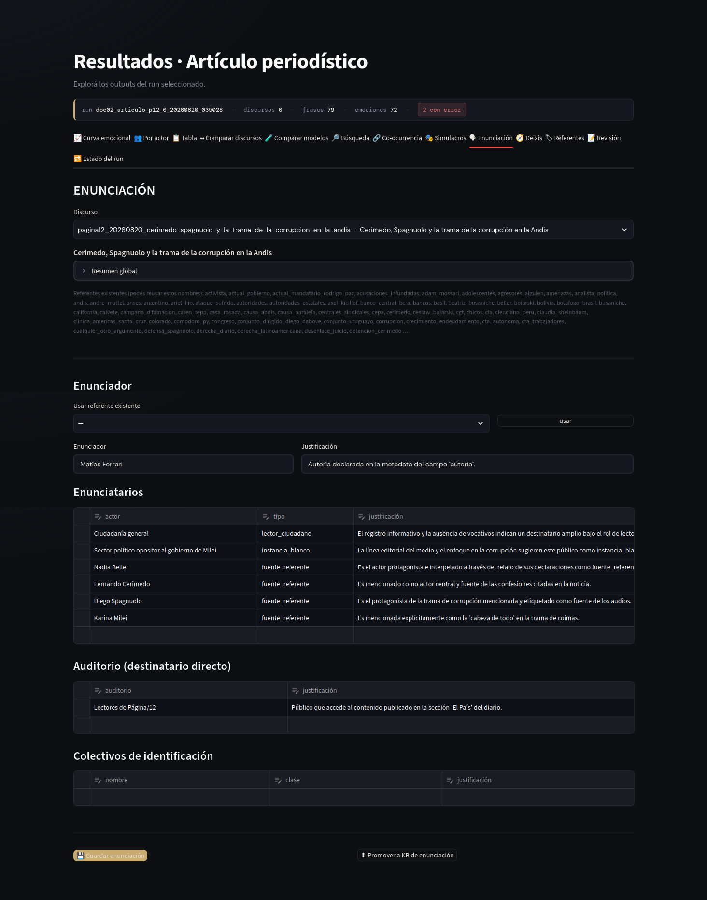
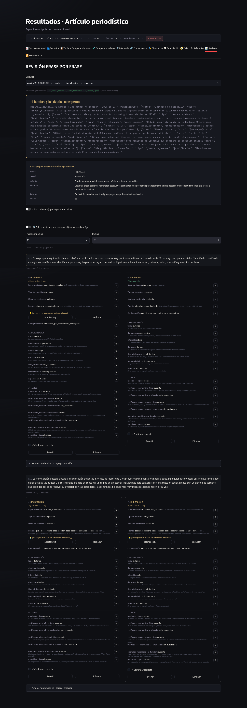
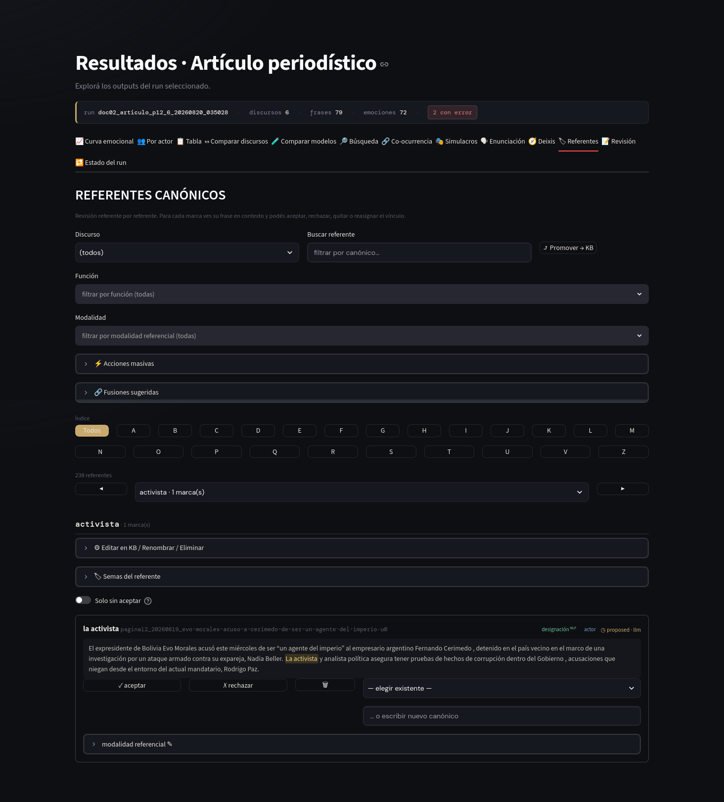

# Tutorial de uso de EmoParse: artículos periodísticos

*Tutorial para analistas del discurso y cientistas sociales. No hace falta experiencia en
programación: cada paso indica exactamente qué escribir. Las notas explican la maquinaria cuando
resulta útil para interpretar los resultados.*

## Qué vas a lograr

Al terminar vas a tener un corpus local de artículos periodísticos, una base de análisis separada y
un conjunto de resultados que permita preguntar, por ejemplo:

- ¿qué emociones se atribuyen a protagonistas, fuentes y públicos?
- ¿qué actores aparecen como origen de temor, indignación, esperanza o alivio?
- ¿cómo cambia la construcción emocional entre secciones o tipos de artículo?
- ¿qué relación hay entre la firma, el medio, las voces citadas y la escena enunciativa?
- ¿qué fragmentos sostienen cada lectura y cuáles requieren corrección humana?

EmoParse implementa este dominio con el género `articulo_periodistico`. El cuerpo se corta por
párrafos y la metadata editorial se conserva como contexto: medio, sección, volanta, subtítulo,
autoría, agencia, epígrafe e idioma.

## Antes de empezar: qué diferencia a un artículo

Un artículo no es un discurso presidencial escrito. La firma puede ser una persona, varias personas
o una agencia; el medio forma parte de la escena editorial, pero no reemplaza automáticamente a la
firma. El texto organiza además distintas voces: quien escribe, las fuentes citadas, los actores
sobre los que informa y los públicos a los que se dirige.

El género periodístico usa tres posiciones de destinatario:

- `lector_ciudadano`: el público amplio al que se informa;
- `instancia_blanco`: el público calculado por la estrategia editorial y el ángulo de la nota;
- `fuente_referente`: una fuente o protagonista que el texto cita, menciona o toma como referencia.

Son hipótesis analíticas. La tab **Enunciación** permite revisarlas antes de continuar con las
emociones.

## Paso 0 — Instalar

Necesitás Python 3.11 o superior. Para este tutorial hacen falta el backend local, el tablero y el
scraper:

```bash
git clone https://github.com/alexdcolman/EmoParse.git
cd EmoParse
python -m venv .venv
source .venv/bin/activate
pip install -e ".[llamacpp,ui,nlp,scraping,agents,data,utils]"
```

Copiá la configuración de ejemplo y ajustá las rutas de los modelos:

```bash
cp config.example.yaml config.yaml
```



## Paso 1 — Conseguir un corpus

EmoParse incluye una fuente para Página/12. El adapter V4 descubre artículos mediante feeds RSS de
secciones y, cuando corresponde, el sitemap oficial. Normaliza el cuerpo y conserva por separado la
metadata, el paratexto y la estructura fuente disponible.

```bash
emoparse scrape \
  --source pagina12 \
  --output data/pagina12_julio_2026.csv \
  --from 2026-07-01 \
  --to 2026-07-31 \
  --section economia,cultura \
  --subtype static \
  --max 20
```

`--section` puede repetirse o recibir varias secciones separadas por coma. Para la zona cultural se
aceptan los nombres asociados a Cultura y Cultura y Espectáculos. `--subtype` permite seleccionar
`static`, `lbp_article` o ambos, por ejemplo `--subtype static,lbp_article`. Si se omite, el adapter
admite ambos subtipos públicos.

Los `lbp_article` se reconstruyen a partir de sus actualizaciones `lbp_update` en orden editorial.
Embeds, contactos, media, bylines aisladas y recirculación no se mezclan con el cuerpo textual. Esa
información, junto con metadata y paratexto fuente, se conserva en `raw` para auditoría.

La adquisición es incremental: si el CSV ya existe, agrega artículos nuevos sin repetir las URLs
que ya contiene. `--max N` cuenta artículos efectivamente extraídos, aceptados y escritos; una URL
fallida, vacía, filtrada o ya existente no consume el límite.

El archivo resultante incluye las columnas generales -como `codigo`, `titulo`, `fecha`, `contenido`
y `url`- y, cuando la página las ofrece, `medio`, `seccion`, `volanta`, `subtitulo`, `autoria`,
`agencia`, `epigrafe` e `idioma`. `raw` conserva la evidencia fuente estructurada sin convertirse en
parte de `contenido`.

Las capturas de este tutorial usan como ejemplo un corpus pequeño de seis artículos `static` de
Página/12, uno por sección. No hace falta construir un corpus especial para reproducir las vistas.



También podés usar un corpus propio. Como mínimo debe tener `codigo` y `contenido`. Las columnas
editoriales son opcionales, pero enriquecen la escena y ayudan a revisar la extracción.

## Paso 2 — Preparar y revisar el corpus sin modelos

Antes de gastar tiempo de inferencia podés crear la base, validar la metadata y segmentar los
artículos por párrafo:

```bash
emoparse run \
  --config config.yaml \
  --genre articulo_periodistico \
  --input data/pagina12_julio_2026.csv \
  --run-id pagina12_julio_2026 \
  --db runs/pagina12_julio_2026.sqlite \
  --prepare-only
```

`--prepare-only` no ejecuta etapas ni carga modelos. Deja la SQLite lista para comprobar cuántos
artículos y párrafos ingresaron. Después podés continuar sobre la misma base con `--resume`.

```bash
emoparse status --db runs/pagina12_julio_2026.sqlite
```

## Paso 3 — Construir el contexto del artículo

Empezá por las etapas de nivel documento:

```bash
emoparse run \
  --config config.yaml \
  --genre articulo_periodistico \
  --input data/pagina12_julio_2026.csv \
  --run-id pagina12_julio_2026 \
  --db runs/pagina12_julio_2026.sqlite \
  --resume \
  --stages summarizer,metadata,enunciation
```

Revisá en el tablero:

```bash
emoparse app
```

En **Enunciación**, comprobá especialmente:

- que la firma figure como enunciador cuando `autoria` está disponible;
- que el medio no haya sustituido a la firma;
- que una agencia se conserve como metadata cuando corresponde;
- que los roles de destinatario tengan actores concretos y no etiquetas genéricas;
- que las voces citadas no se confundan automáticamente con quien escribe.



La tab **Revisión** muestra la metadata editorial con sus etiquetas. La tab **Tabla** mantiene los
nombres estables del corpus para que las exportaciones sean comparables.



## Paso 4 — Detectar emociones por párrafo

Corré primero los actores y la detección:

```bash
emoparse run \
  --config config.yaml \
  --genre articulo_periodistico \
  --input data/pagina12_julio_2026.csv \
  --run-id pagina12_julio_2026 \
  --db runs/pagina12_julio_2026.sqlite \
  --resume \
  --stages summarizer,metadata,enunciation,actors,emotions,explode_emotions
```

Cada párrafo se analiza como unidad. `actors` es opcional, pero ayuda a presentar los actores del
fragmento antes de detectar emociones. `explode_emotions` separa cada emoción y crea los primeros
vínculos entre sus marcas y los referentes.

Antes de seguir, hacé una primera revisión en **Referentes**. En artículos periodísticos es frecuente
que una misma entidad aparezca como nombre propio, cargo, institución o pronombre. La vista permite
recorrer las entidades detectadas y decidir si alguna denominación debe unificarse con otra.



## Paso 5 — Normalizar y caracterizar

```bash
emoparse run \
  --config config.yaml \
  --genre articulo_periodistico \
  --input data/pagina12_julio_2026.csv \
  --run-id pagina12_julio_2026 \
  --db runs/pagina12_julio_2026.sqlite \
  --resume \
  --stages summarizer,metadata,enunciation,actors,emotions,explode_emotions,normalize_emotions,characterizer
```

La detección conserva el nombre abierto que produjo el modelo. La normalización agrega un nombre
canónico cuando encuentra una correspondencia, sin borrar la etiqueta original. La caracterización
suma foria, intensidad, dominancia, duración, temporalidad y otras dimensiones.

Revisá en particular:

- emociones atribuidas a la firma, a una fuente o a un actor narrado;
- emociones mencionadas dentro de una cita que no necesariamente asume quien escribe;
- fuentes causales que combinan varias entidades;
- párrafos descriptivos donde la emoción se sostiene por la escena y no por una palabra emocional.

## Paso 6 — Profundizar

Las etapas opcionales se corren una por vez, revisando el resultado de cada una:

Cada ejemplo retoma la misma base. Ejecutá únicamente la etapa que quieras revisar:

```bash
# Segunda lectura con los párrafos anteriores del mismo artículo
emoparse run \
  --config config.yaml \
  --genre articulo_periodistico \
  --input data/pagina12_julio_2026.csv \
  --run-id pagina12_julio_2026 \
  --db runs/pagina12_julio_2026.sqlite \
  --resume \
  --stages summarizer,metadata,enunciation,emotions,emotions_pass2

# Resolución de yo, nosotros, ustedes y otras marcas deícticas
emoparse run \
  --config config.yaml \
  --genre articulo_periodistico \
  --input data/pagina12_julio_2026.csv \
  --run-id pagina12_julio_2026 \
  --db runs/pagina12_julio_2026.sqlite \
  --resume \
  --stages summarizer,metadata,enunciation,emotions,explode_emotions,deixis

# Forma en que cada marca refiere a su referente
emoparse run \
  --config config.yaml \
  --genre articulo_periodistico \
  --input data/pagina12_julio_2026.csv \
  --run-id pagina12_julio_2026 \
  --db runs/pagina12_julio_2026.sqlite \
  --resume \
  --stages summarizer,metadata,enunciation,emotions,explode_emotions,modalidad

# Rasgos semánticos de los referentes ya unificados
emoparse run \
  --config config.yaml \
  --genre articulo_periodistico \
  --input data/pagina12_julio_2026.csv \
  --run-id pagina12_julio_2026 \
  --db runs/pagina12_julio_2026.sqlite \
  --resume \
  --stages summarizer,metadata,enunciation,emotions,explode_emotions,semas

# Mediadores, verificadores, operadores y polaridad
emoparse run \
  --config config.yaml \
  --genre articulo_periodistico \
  --input data/pagina12_julio_2026.csv \
  --run-id pagina12_julio_2026 \
  --db runs/pagina12_julio_2026.sqlite \
  --resume \
  --stages summarizer,metadata,enunciation,emotions,explode_emotions,actants

# Auditoría acotada con un segundo modelo
emoparse run \
  --config config.yaml \
  --genre articulo_periodistico \
  --input data/pagina12_julio_2026.csv \
  --run-id pagina12_julio_2026 \
  --db runs/pagina12_julio_2026.sqlite \
  --resume \
  --stages summarizer,metadata,enunciation,emotions,explode_emotions,normalize_emotions,characterizer,judge
```

La segunda lectura puede resultar útil en artículos largos, porque retoma el contexto de párrafos
anteriores. No reemplaza la evidencia de la unidad actual: una emoción agregada debe seguir apoyada
en el párrafo que se está anotando.

## Paso 7 — Explorar y comparar

En el tablero podés usar:

- **Curva emocional**, para seguir la distribución de emociones a lo largo de cada artículo;
- **Por actor**, para comparar qué se atribuye a protagonistas, fuentes y públicos;
- **Búsqueda**, para localizar marcas, actores o emociones;
- **Co-ocurrencia**, para ver qué emociones aparecen juntas en un párrafo;
- **Simulacros**, para reconstruir la relación entre experienciador, emoción y fuente;
- **Comparar discursos**, para contrastar artículos, secciones o firmas;
- **Revisión**, para corregir cada unidad con el texto y la metadata editorial a la vista.

El tablero no reemplaza una lectura cualitativa. Sirve para recorrer un corpus amplio, encontrar
patrones y volver rápidamente al párrafo que sostiene cada resultado.

## Paso 8 — Exportar

```bash
emoparse export \
  --db runs/pagina12_julio_2026.sqlite \
  --output-dir exports/pagina12_julio_2026
```

La exportación incluye:

- `discursos.csv`: una fila por artículo;
- `metadata_genero.csv`: una fila por campo editorial y artículo, incluida su ausencia;
- `frases.csv`: una fila por párrafo;
- `emociones.csv`: una fila por emoción.

`metadata_genero.csv` permite medir cobertura de autoría, sección, subtítulo, agencia o epígrafe sin
escribir código específico para este género.

## Paso 9 — Validar una muestra

Cuando el corpus esté revisado, podés preparar una muestra a ciegas:

```bash
emoparse eval \
  --db runs/pagina12_julio_2026.sqlite \
  --make-sample \
  --n 200 \
  --min-textos 15 \
  --max-por-texto 12 \
  --out evals/muestra_articulos.csv
```

La planilla no muestra las respuestas del modelo. La anotación humana permite medir después cuánto
cambia la salida entre configuraciones o versiones.


## Preguntas frecuentes

**¿Puedo analizar otro medio?**

Sí. Podés importar un CSV propio con la misma estructura. La fuente `pagina12` resuelve la
adquisición; el género `articulo_periodistico` resuelve el análisis.

**¿El medio es siempre el enunciador?**

No. Cuando existe una firma, se usa como instancia emisora. El medio queda como parte del contexto
editorial. En una nota sin firma o con una voz institucional, la revisión humana sigue siendo
necesaria.

**¿Una cita transmite la emoción de quien escribe?**

No necesariamente. La emoción puede pertenecer a la persona citada, ser presentada como objeto o ser
reencuadrada por el artículo. Hay que revisar experienciador, fuente y marca.

**¿Por qué se corta por párrafos?**

El párrafo suele reunir una unidad informativa más estable que una oración aislada en este género y
permite conservar la relación entre relato, cita y comentario editorial.
