# Tutorial de uso de EmoParse: discursos presidenciales

*Tutorial para analistas del discurso y cientistas sociales en general. No hace falta experiencia en programación: cada paso indica exactamente qué escribir. Las notas al pie explican la maquinaria computacional para el que tenga ganas de profundizar.*

*Los conceptos principales del enfoque teórico-metodológico están repuestos [en este diccionario conceptual](https://github.com/alexdcolman/EmoParse/blob/main/docs/CONCEPTOS.md).*

## Qué vas a lograr

La idea es que al final de este tutorial hayas analizado un pequeño corpus de discursos presidenciales y puedas responder, con evidencia sistemática, preguntas como:

- ¿Qué emociones construye este discurso?
- ¿A quién están dirigidas?
- ¿Quién tiene miedo, quién expectativas, quién se indigna y ante qué cosas?
- ¿Cómo se distribuyen la euforia y la disforia a lo largo de cada texto?
- ¿Qué emociones tienden a aparecer juntas en una misma frase, y qué dice eso sobre la gramática afectiva del discurso?
- ¿Qué instancias regulan socialmente esas emociones (qué está bien sentir, qué no)?
- ¿Qué entidades median la circulación de ciertas emociones?
- ¿A quién remite cada "nosotros" o cada "ustedes" en cada discurso?
- ¿Qué diferencias hay entre dos discursos del mismo orador, o entre distintas situaciones de enunciación?

EmoParse no hace análisis de sentimientos, sino que reconstruye el **simulacro emocional** de cada emoción. Este concepto refiere a *la forma esquemática que adquiere la reconstrucción metadiscursiva de una emoción discursiva*. Es decir, es una interpretación que indica:

1. Qué emoción tiene presencia en el discurso.
2. Quién la experimenta (enunciador, enunciatarios, actores discursivos nombrados).
3. Según qué modo de existencia discursivo (realizada, potencial, virtual, actual), con qué intensidad (alta, baja, media), y qué dominancia (corporal, cognoscitiva o mixta) y foria (euforia, disforia, aforia, ambiforia) tiene esa emoción.
4. Cuál es su duración, su temporalidad y su aspectualidad.
5. Qué fuente desencadena la emoción (objetos, espacios, discursos, acontecimientos, etc.) y si hay alguna entidad que medie su circulación.
6. Si hay instancias que verifican si la emoción es adecuada a una norma o a una situación, o si la emoción fue efectivamente realizada o no.
7. Si hay manipulación, activación o inhibición de la emoción.
8. Si alguien se atribuye la emoción a sí mismo o a otro actor.
9. Todos estos elementos quedan vinculados en la base de datos junto con las marcas discursivas que sostienen la interpretación, y con otras características como el tipo de configuración de la emoción,¹ su modo de semiotización, su modo de identificación (emoción explícita o inferida por señales de entrada o de salida) y el modo en que cada marca discursiva se vincula con el referente al que remite.²

> ¹ Hay ocho clases:
> (1) emociones sostenidas en sustantivos (“la tristeza de Mara” → tristeza),
> (2) emociones sostenidas en adjetivos (“los testigos estaban nerviosos” → nervios),
> (3) emociones sostenidas en verbos psicológicos (“los manifestantes se enojaron” → enojo),
> (4) emociones sostenidas en indicadores cognitivos (“totalmente concentrado en resolver el problema” → preocupación),
> (5) emociones sostenidas en indicadores de comportamiento (“¡asesino!” → ira, horror o desesperación, “evitó el contacto visual” → miedo, vergüenza),
> (6) emociones sostenidas en indicadores axiológicos (“una medida injusta y arbitraria” → rechazo, indignación),
> (7) emociones sostenidas en formateos descriptivo-narrativos (“los policías irrumpieron a la madrugada en el edificio” → sorpresa, temor u otras según contexto narrativo), y
> (8) emociones sostenidas en la transposición de una situación de reconocimiento potencial que induce una emoción al enunciatario (“resulta evidente la gravedad del contexto” → si imaginamos una situación donde alguien le dice esto a otras personas, podemos interpretar que intenta inducir preocupación).
> De esta clasificación, realizada por el LLM, se deriva determinísticamente el modo de semiotización de la emoción, que puede ser “dicha”, si hay términos de emoción: casos (1), (2) y (3); “mostrada”, si es una emoción expresada sin ser dicha: casos (4), (5) y (6); o “sostenida”, si es una emoción que no es dicha ni expresada, pero igualmente puede inferirse de la construcción o escenificación de una determinada situación.

> ² El marco combina la semiótica greimasiana y tensiva (Greimas, Fontanille, Zilberberg), la propuesta de Verón y el análisis de las emociones de Plantin y Micheli, entre otros. Técnicamente, el análisis lo realizan modelos de lenguaje (LLM) **locales**, por lo que nada de tu corpus sale de tu computadora.

## Antes de empezar: cómo conviene trabajar

EmoParse no está pensado para correrse de punta a punta en un solo comando y mirar el resultado recién al final. Cada etapa (stage) del programa es una hipótesis sobre el discurso, y esas hipótesis se van apilando: si la etapa que identifica quién habla y a quién le habla se equivoca, todo lo que se construye después —quién siente qué, sobre quién recae cada emoción— hereda ese error. Por eso el modo de trabajo que mejor funciona es ir de a poco: correr un bloque chico de etapas, mirar cómo salió en el dashboard, corregir lo que haga falta, y recién ahí seguir con el bloque siguiente.

Esto tiene que ver con algo más de fondo. El sistema no reemplaza tu lectura: hace una primera lectura sistemática, apoyada en un modelo de lenguaje, que vos después revisás, corregís y, en algunos puntos, tenés que terminar de resolver a mano porque ninguna heurística automática lo hace bien del todo. El programa está armado para sostener esa cooperación: cada corrección que hacés en la app queda guardada aparte, sin pisar la lectura original del modelo, así que en cualquier momento podés ver ambas versiones y volver atrás si te equivocaste.

## Paso 0 — Instalación (una sola vez)

Necesitás Python 3.11 o superior y unos 20 GB de disco para los modelos. Si tenés placa de video (GPU), el análisis va a andar bastante más rápido; sin GPU también funciona, pero conviene usar modelos chicos y corpus acotados.

```bash
git clone https://github.com/alexdcolman/EmoParse.git
cd EmoParse
python -m venv .venv && source .venv/bin/activate
pip install -e ".[llamacpp,ui,nlp,agents,data,utils]"
```

Descargá un modelo de lenguaje en formato GGUF³ (el README recomienda opciones según tu hardware) y copiá la configuración de ejemplo:

```bash
cp config.example.yaml config.yaml
```

Abrí `config.yaml` con cualquier editor de texto y ajustá la ruta del modelo (`path:`) a donde lo descargaste. Con eso alcanza para empezar.

> ³ GGUF es un formato de modelos comprimidos ("cuantizados") que corren en una computadora personal vía `llama.cpp`. La generación usa "gramáticas GBNF". Esto significa que el modelo está *obligado* a responder en el formato estructurado que el sistema espera, y no puede divagar ni inventar campos.

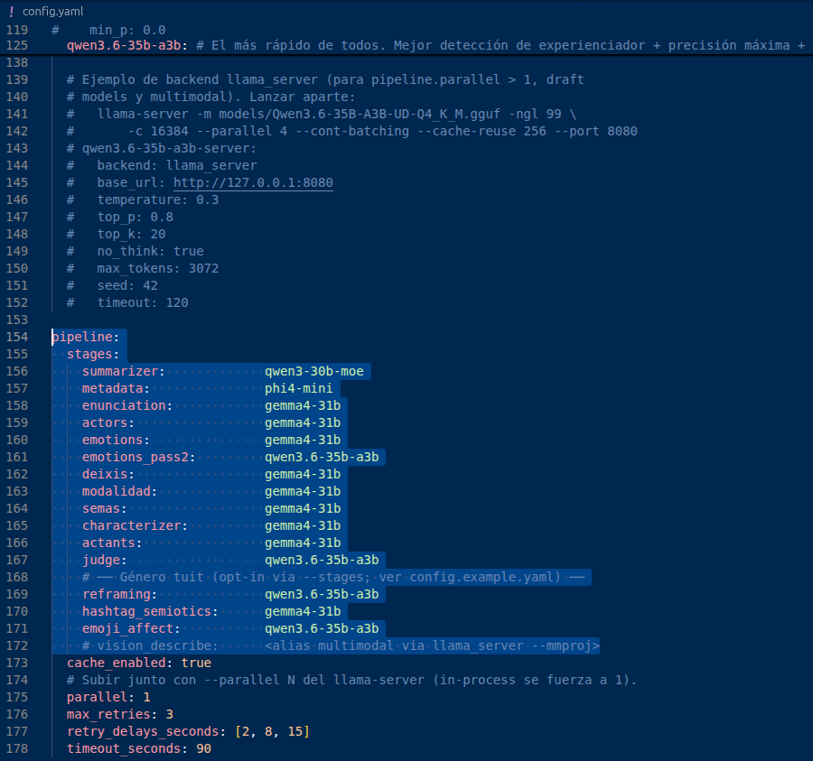

## Paso 1 — Conseguir un corpus

**Opción A (recomendada para empezar): scrapear Casa Rosada.** EmoParse trae un extractor de discursos de presidentes argentinos:

```bash
pip install -e ".[scraping]"
emoparse scrape --source casarosada --max 5 --output data/discursos.csv
```

**Opción B: tu propio corpus.** Un archivo CSV con dos columnas obligatorias — `codigo` (un identificador único por discurso) y `contenido` (el texto completo) — y opcionales como `titulo`, `fecha`, `lugar`. Podés armarlo en Excel o Google Sheets y guardar como CSV.

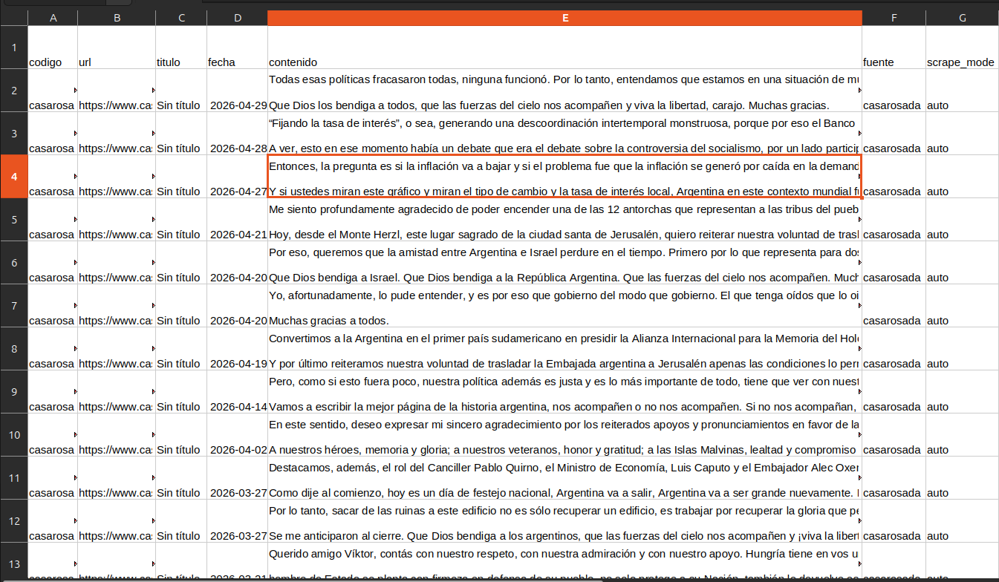

## Paso 2 — Correr el análisis

Con `--stages` elegís qué etapas correr en ese comando puntual. El primer comando crea la base;
los siguientes usan `--resume` para continuar exactamente la misma corrida. Podés interrumpir con
Ctrl-C: lo ya persistido no se repite.⁴

Un recorrido que funciona bien en la práctica:

**1. Contexto del discurso.** Corré `summarizer`, `metadata` y `enunciation`. Estas tres etapas trabajan
sobre el discurso completo: arman un resumen, identifican el tipo de discurso y dónde fue pronunciado,
y reconstruyen la escena enunciativa (quién habla, a quién, con qué colectivos se identifica).⁵

```bash
emoparse run \
  --config config.yaml \
  --input data/<tu_archivo_csv>.csv \
  --genre discurso_presidencial \
  --run-id <nombre_de_tu_run> \
  --db runs/<nombre_de_tu_run>.sqlite \
  --stages summarizer,metadata,enunciation
```

Cuando termine, abrí el dashboard (`emoparse app`) y revisá la tab **Enunciación**. Si el enunciador
o el auditorio están mal identificados, lo que sigue va a heredar ese error.

**2. Actores, emociones y referentes iniciales.** El siguiente comando detecta actores y emociones
frase por frase. `explode_emotions` separa después cada emoción en una fila y siembra los primeros
vínculos entre marcas del texto —«el presidente», «Milei», «nosotros»— y sus referentes.

```bash
emoparse run \
  --config config.yaml \
  --input data/<tu_archivo_csv>.csv \
  --genre discurso_presidencial \
  --run-id <nombre_de_tu_run> \
  --db runs/<nombre_de_tu_run>.sqlite \
  --resume \
  --stages summarizer,metadata,enunciation,actors,emotions,explode_emotions
```

**3. Revisar y unificar referentes.** Antes de seguir, andá a la tab **Referentes** del dashboard y
hacé una primera pasada. No hace falta que quede perfecta, pero conviene resolver los casos más
obvios antes de generar la caracterización fina.

**4. Normalizar y caracterizar.** La normalización agrega un nombre canónico sin borrar la etiqueta
original; `characterizer` produce el perfil detallado de cada emoción.

```bash
emoparse run \
  --config config.yaml \
  --input data/<tu_archivo_csv>.csv \
  --genre discurso_presidencial \
  --run-id <nombre_de_tu_run> \
  --db runs/<nombre_de_tu_run>.sqlite \
  --resume \
  --stages summarizer,metadata,enunciation,actors,emotions,explode_emotions,normalize_emotions,characterizer
```

**5. Etapas opcionales, una por vez.** A partir de acá, según lo que te interese, sumá
`emotions_pass2`, `deixis`, `modalidad`, `semas`, `actants` o `judge` (Paso 4). Revisá cada resultado
antes de avanzar.

```bash
# Ver el progreso en cualquier momento, desde otra terminal:
emoparse status --db runs/<nombre_de_tu_run>.sqlite
```

> ⁴ Cada etapa es un modelo de IA con un prompt especializado y un esquema de salida estricto (Pydantic + GBNF). Todo se guarda en una base SQLite por corrida, con un cache que evita repetir trabajo: si volvés a correr una etapa que ya se ejecutó con la misma configuración, el sistema reusa la respuesta guardada en vez de volver a consultar el modelo.

> ⁵ Para discurso político, usamos las categorías de Verón (1983): prodestinatario (el propio); paradestinatario (el indeciso a persuadir); contradestinatario (el adversario). La etapa `enunciation` identifica además el auditorio (el destinatario directo del discurso) y los colectivos con los que el enunciador se identifica ("los argentinos", un movimiento político, etc.); esto es la base sobre la que trabaja después la resolución de deixis.

## Paso 3 — Explorar los resultados

```bash
emoparse app
```

Se abre el dashboard en tu navegador, con una tab por cada clase de exploración. Estas son algunas de las que vas a usar:

- **📈 Curva emocional** — la trayectoria emocional del discurso: en qué partes se concentran ciertas emociones, filtrable según quiénes las experimentan, qué rasgos semánticos comparten esos experienciadores (por ejemplo, "+ víctima" o "+ victimario") — para eso hay que correr la etapa `semas` — y qué fuentes las originan. Por ejemplo, los discursos políticos suelen tener *arquitecturas* fóricas reconocibles: diagnóstico disfórico → resolución eufórica, etc.

  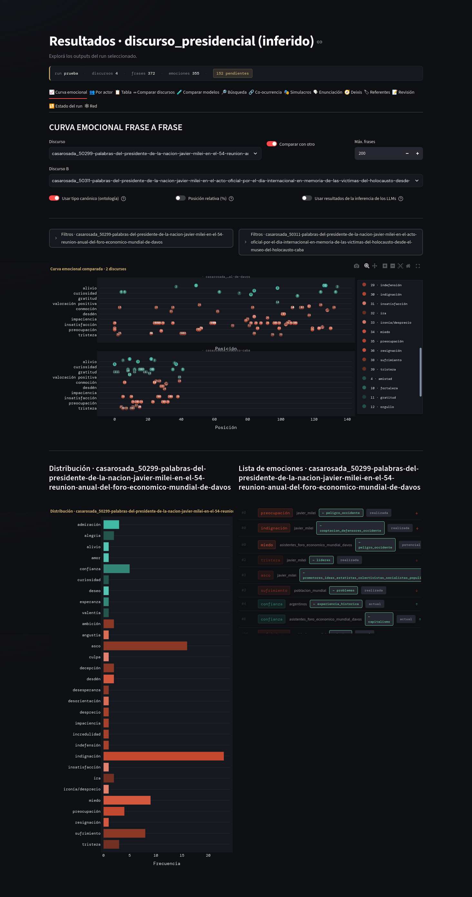

- **👥 Por actor** — el mapa de calor actor × emoción: ¿a quién se le suele atribuir el miedo? ¿quién es fuente de indignación? Acá se ve la *distribución pasional del trabajo político*: el adversario como fuente de disforia, el colectivo propio como experienciador de esperanza, etc. Al lado hay un scatter que cruza foria e intensidad por actor.

  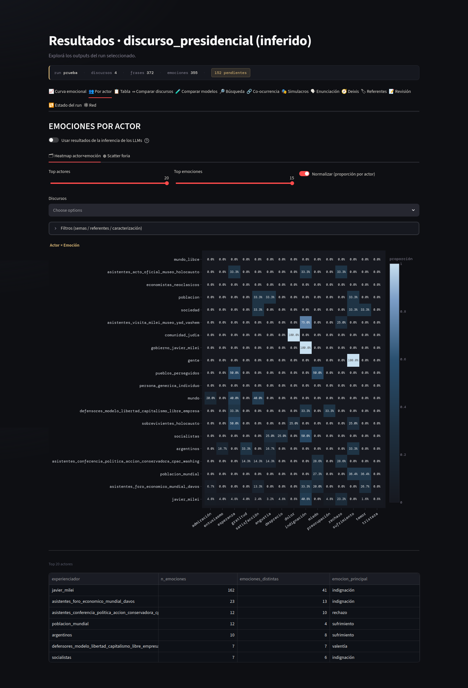

- **🔎 Búsqueda** y **📋 Tabla** — exploración fina: todas las frases donde aparece determinada emoción, actor, palabra o frase, con su análisis completo. La tabla exporta a CSV.

  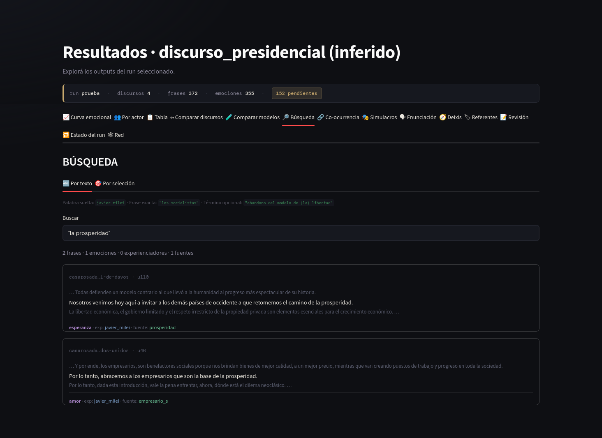

- **🔗 Co-ocurrencia** — qué emociones tienden a aparecer juntas en la misma frase. Una matriz de asociación y un ranking de pares: por ejemplo, puede aparecer que el desprecio y la indignación coexisten con frecuencia, lo que empieza a describir una gramática afectiva propia del corpus. Al seleccionar un par, el dashboard muestra las frases donde ambas emociones coexisten, con su análisis completo: siempre se puede bajar del patrón agregado a la frase concreta que lo sostiene.

  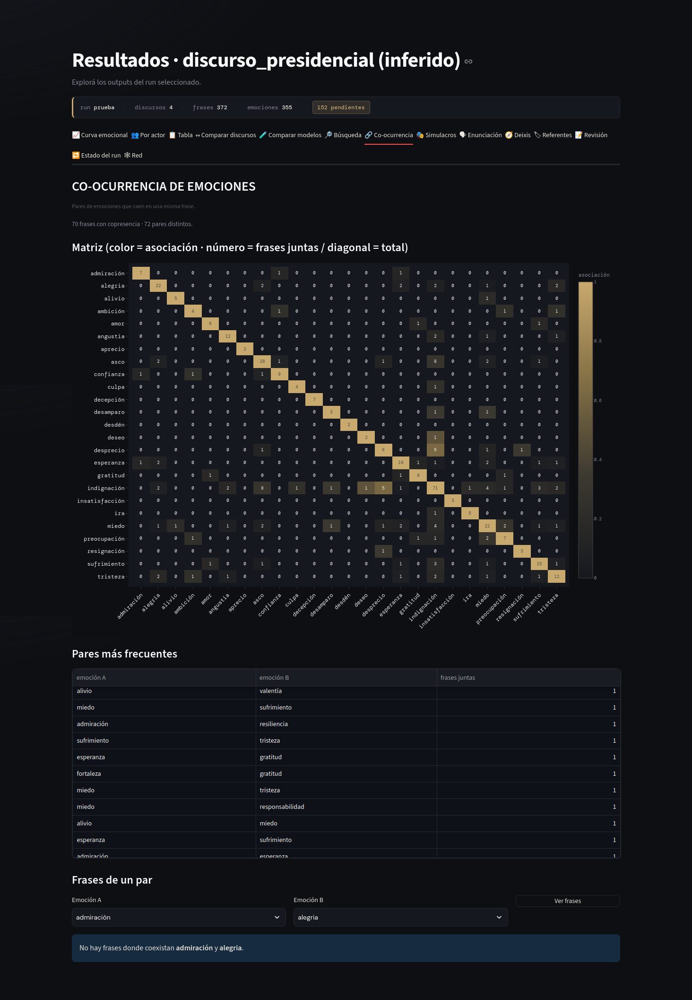

- **🎭 Simulacros** — la reconstrucción analítica de cada emoción con sus funciones actanciales principales y —si corriste actants— secundarias: experienciador, emoción, fuente, mediador, verificadores, operador de modificación.

  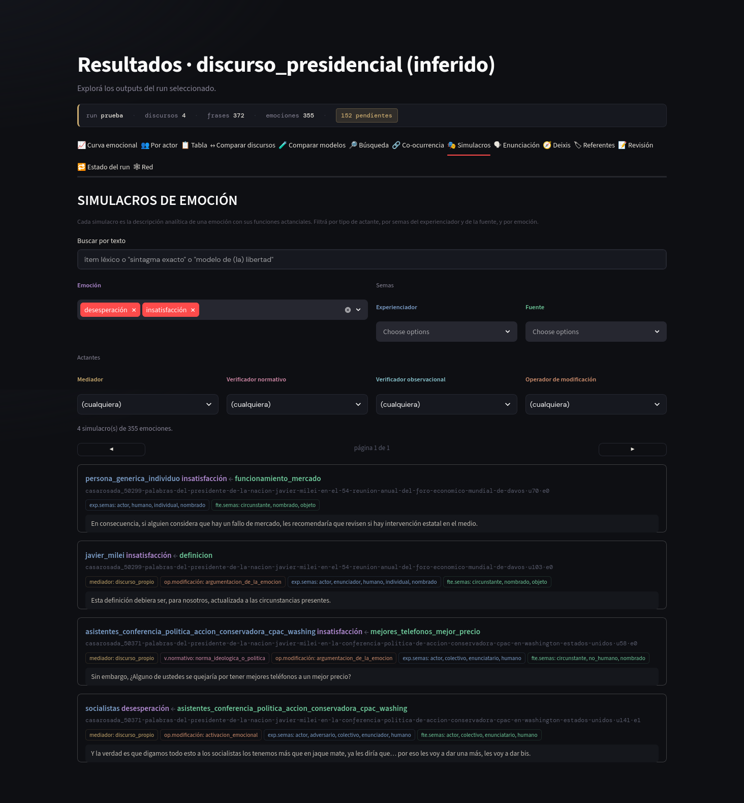

- **🧭 Deixis** — revisión, paginada, de las sugerencias de la etapa `deixis`: a qué referente concreto remite cada "yo", cada "nosotros", cada "ustedes" (también pronombres posesivos y verbos conjugados). Aceptás o rechazás cada propuesta, o asignás otro referente del discurso.

- **↔ Comparar discursos** — perfil emocional, radar, trayectoria temporal y timeline de varios discursos: por ejemplo, dos momentos de una presidencia, dos oradores, antes y después de una crisis, dos situaciones de enunciación distintas.

  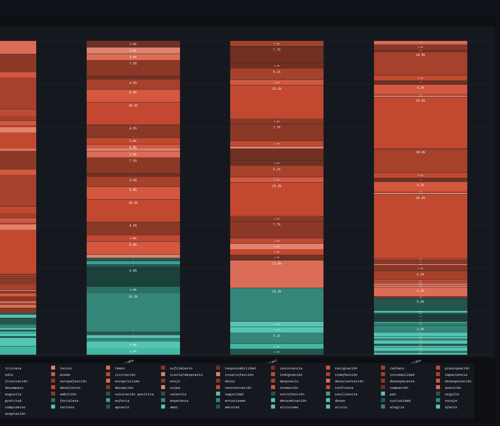
  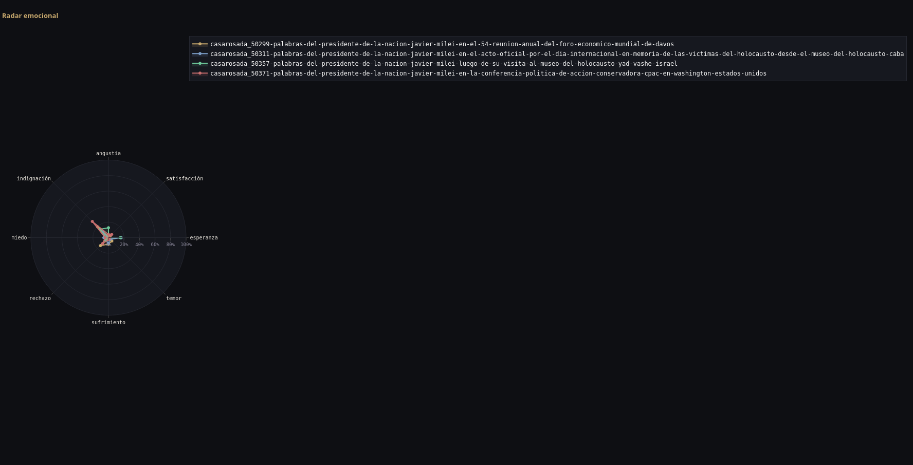
  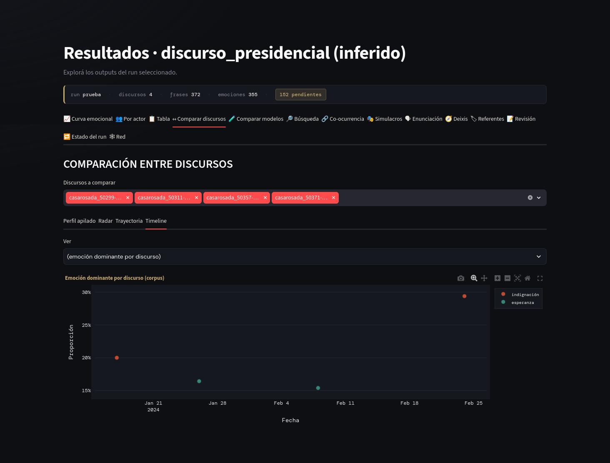

- **📝 Revisión** — acá hay una parte importante del corazón metodológico: el análisis del modelo es una *primera lectura sistemática*, no un veredicto. Esta tab deja revisar frase por frase, corregir experienciadores, fuentes o tipos, aceptar o rechazar las sugerencias del "juez" (un segundo modelo que audita al primero, si corriste esa etapa), y consolidar las decisiones. El criterio del analista siempre tiene la última palabra: cada corrección queda registrada aparte, sin borrar la lectura original del modelo.

  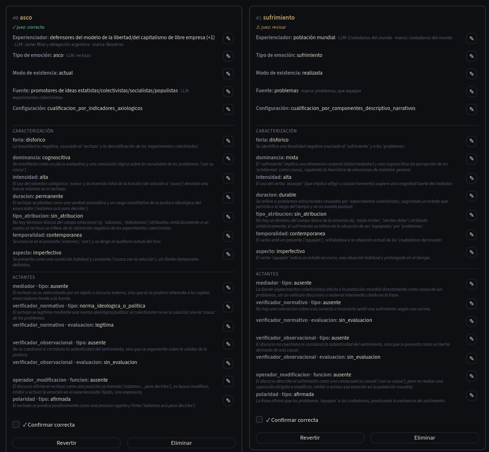

- **🔁 Estado del run** — el progreso de cada etapa, y algunas herramientas de triage: actores nuevos que aparecieron, experienciadores para consolidar, y un editor de la base de actores conocidos.

- **🧩 Referentes** — todas las marcas del corpus agrupadas por el referente al que remiten, con herramientas para fusionar, corregir o descartar vínculos. Le dedicamos la sección siguiente porque es, en la práctica, donde más tiempo de trabajo humano se invierte.

  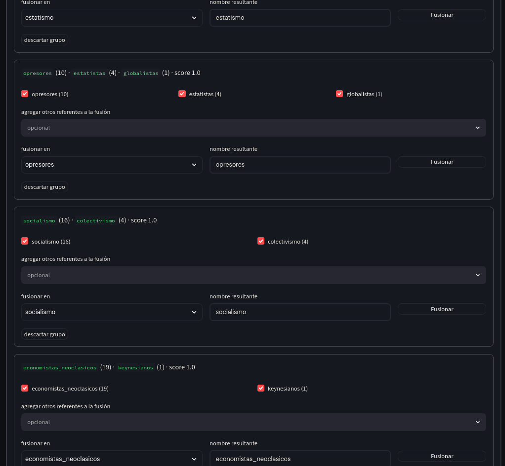

## La unificación de referentes: por qué esto es trabajo artesanal

Cuando el sistema lee "el presidente", "Milei", "él" y "nosotros" en un mismo discurso, tiene que decidir en algún momento cuáles de esas marcas remiten a la misma persona y cuáles no. Esa decisión —**unificación de referentes**— es la que hace posible después preguntar cosas como "¿quién es la fuente de indignación más frecuente?", porque sin ella cada nombre distinto contaría como un actor generalmente distinto y el análisis por actor no diría mucho.

El sistema arma una primera versión de esta unificación de forma automática, sin modelos de IA: agrupa marcas que coinciden textualmente, que comparten palabras significativas, o que el propio modelo ya identificó como la misma entidad al detectar actores y emociones.⁶ Pero esta construcción automática es **deliberadamente conservadora**: ante la duda, el sistema prefiere dejar dos marcas parecidas sin unir antes que fusionarlas y borrar una distinción que el corpus efectivamente sostenía. La consecuencia práctica es que van a quedar casi-duplicados —"la sociedad", "la sociedad humana", "nuestra sociedad"— que el sistema no unió automáticamente.

Ahí es donde entra el trabajo de revisión, en la tab **Referentes**. El dashboard te ofrece sugerencias de fusión (comparando qué tan parecidos son los nombres, y opcionalmente qué tan cercanos son en significado)⁷, pero la fusión final la hacés vos: elegís qué casos son en verdad la misma entidad y cuáles conviene mantener separados. Es trabajo artesanal porque no hay, por el momento, atajo que lo reemplace del todo, y cuanto más grande es el corpus, más tiempo lleva. Lo bueno es que no se pierde entre corridas: podés promover los referentes ya revisados a una base persistente, así que la próxima vez que analices un corpus parecido, buena parte de ese trabajo ya está hecho.

> ⁶ Técnicamente, esto vive en la etapa `explode_emotions` y combina cuatro criterios: correferencia léxica conservadora, la inferencia dominante que hizo el propio LLM al detectar el actor, la resolución de deixis de primera persona hacia el enunciador, y coincidencia contra una base de referentes ya conocidos. Los nombres canónicos se arman descartando artículos.

> ⁷ La herramienta de fusiones sugeridas compara solo referentes que comparten alguna palabra significativa (para no tener que comparar todos contra todos), mide similitud léxica, y opcionalmente similitud semántica vía *embeddings* (para captar sinónimos que no comparten palabras). El resultado son grupos candidatos que vos revisás y fusionás a mano, o descartás.

## Paso 4 — Profundizar (opcional)

Una vez que el flujo básico te resulte cómodo, hay varias etapas opcionales que conviene sumar de a una, revisando cada resultado antes de pasar a la siguiente:

```bash
# Segunda lectura de emociones con contexto de las frases previas
emoparse run \
  --config config.yaml \
  --input data/<tu_archivo_csv>.csv \
  --genre discurso_presidencial \
  --run-id <nombre_de_tu_run> \
  --db runs/<nombre_de_tu_run>.sqlite \
  --resume \
  --stages summarizer,metadata,enunciation,emotions,emotions_pass2

# Resolución de deixis
emoparse run \
  --config config.yaml \
  --input data/<tu_archivo_csv>.csv \
  --genre discurso_presidencial \
  --run-id <nombre_de_tu_run> \
  --db runs/<nombre_de_tu_run>.sqlite \
  --resume \
  --stages summarizer,metadata,enunciation,emotions,explode_emotions,deixis

# Modalidad referencial
emoparse run \
  --config config.yaml \
  --input data/<tu_archivo_csv>.csv \
  --genre discurso_presidencial \
  --run-id <nombre_de_tu_run> \
  --db runs/<nombre_de_tu_run>.sqlite \
  --resume \
  --stages summarizer,metadata,enunciation,emotions,explode_emotions,modalidad

# Semas de los referentes ya unificados
emoparse run \
  --config config.yaml \
  --input data/<tu_archivo_csv>.csv \
  --genre discurso_presidencial \
  --run-id <nombre_de_tu_run> \
  --db runs/<nombre_de_tu_run>.sqlite \
  --resume \
  --stages summarizer,metadata,enunciation,emotions,explode_emotions,semas

# Análisis actancial de cada emoción
emoparse run \
  --config config.yaml \
  --input data/<tu_archivo_csv>.csv \
  --genre discurso_presidencial \
  --run-id <nombre_de_tu_run> \
  --db runs/<nombre_de_tu_run>.sqlite \
  --resume \
  --stages summarizer,metadata,enunciation,emotions,explode_emotions,actants

# Auditoría con un segundo modelo
emoparse run \
  --config config.yaml \
  --input data/<tu_archivo_csv>.csv \
  --genre discurso_presidencial \
  --run-id <nombre_de_tu_run> \
  --db runs/<nombre_de_tu_run>.sqlite \
  --resume \
  --stages summarizer,metadata,enunciation,emotions,explode_emotions,normalize_emotions,characterizer,judge

# Exportar todo a CSV para R, SPSS, Excel u otra herramienta
emoparse export \
  --db runs/<nombre_de_tu_run>.sqlite \
  --output-dir exports/<nombre_de_tu_run>
```

Un par de aclaraciones sobre estas etapas:

- **`modalidad`** no cambia si un vínculo está aceptado o rechazado; le agrega una clasificación aparte. Esto importa porque una misma frase valorativa puede a la vez nombrar a alguien y, sin nombrarlo, caracterizar a otro actor distinto —rechazar el vínculo para "limpiar" la base perdería al experienciador de la emoción—.
- **`judge`** no vuelve a discutir la caracterización fina (foria, intensidad, dominancia): se concentra en los elementos donde el error es más costoso y más verificable —quién siente la emoción y qué la dispara—. Sus sugerencias se aceptan o rechazan en la tab Revisión, con un filtro para ver solo lo que todavía no resolviste.
- **`actants`** es configurable componente por componente: si en tu corpus alguno de los cuatro (mediador, los dos verificadores, operador de modificación) no aporta nada, se puede desactivar sin tocar código.

## Paso 4bis — Agrupar los discursos por su parecido (opcional)

Una vez caracterizadas las emociones, EmoParse puede agrupar los discursos por el **parecido entre los simulacros emocionales** que construyen. Dos pasajes pueden contar "la misma historia emocional" —el mismo tipo de actor experimentando el mismo tipo de emoción ante el mismo tipo de fuente— aunque no compartan las palabras. Esto no necesita corpus de redes: funciona sobre cualquier corpus de discursos.

```bash
emoparse network --db runs/<nombre_de_tu_run>.sqlite --similitud
```

El comando arma un grafo donde cada nodo es una emoción reconstruida y dos emociones se conectan si sus simulacros se parecen; después los agrupa (con el mismo algoritmo de comunidades que usan las redes de interacción) y te muestra qué narra cada grupo: los experienciadores, tipos de emoción y fuentes dominantes de cada uno, los mediadores y verificadores de la emoción, entre otras características. Podés elegir qué componentes del simulacro pesan en el parecido con `--similitud-componentes` (por ejemplo, solo experienciador y tipo de emoción, o sumando la fuente y el mediador, etc.). El resultado se explora en la tab **🕸 Red**, que aparece en cuanto hay un grafo de similitud persistido, y al pasar el cursor por cada nodo ves el simulacro completo, estructurado.

Hay un segundo criterio de agrupamiento, complementario: en vez de agrupar por los componentes del simulacro, agrupa los discursos por el **contenido de su texto**, usando embeddings (vectores que capturan el sentido de cada pasaje):

```bash
emoparse network --db runs/<nombre_de_tu_run>.sqlite --semantico
```

Podés correr los dos juntos (`--similitud --semantico`) y comparar: el narrativo agrupa por *qué historia emocional* se cuenta, el semántico por *de qué se habla*. Son preguntas distintas y a veces revelan estructuras distintas del corpus.⁸

> ⁸ El agrupamiento **narrativo** (`--similitud`) es simbólico y explicable: cada grupo se lee por los componentes del simulacro que comparte. El **semántico** (`--semantico`, extra `embeddings`) agrupa por los vectores del texto y capta cercanías que las palabras exactas no muestran. El semántico rinde especialmente en corpus grandes o donde un mismo contenido se dice de muchas formas distintas (típicamente, redes sociales); en un corpus de discursos chico puede no encontrar suficientes vecinos por encima del umbral y no producir grupos —en ese caso el comando lo informa y sigue sin error, y conviene bajar el umbral o ampliar el corpus—. Vale la pena probar ambos: no compiten, responden preguntas diferentes.

## Paso 5 — Validar

Antes de publicar resultados, medí la validez del análisis sobre tu corpus: el comando `emoparse eval` exporta muestras para anotación humana a ciegas, calcula el acuerdo entre anotadores (alpha de Krippendorff)⁹ y compara el sistema contra un conjunto de referencia. El protocolo completo está en `evals/manual_anotacion.md` y en la documentación.

> ⁹ El alpha de Krippendorff es el estándar en análisis de contenido para medir cuánto acuerdan los codificadores humanos entre sí; ese acuerdo es el techo razonable de lo que puede exigírsele al sistema.

La explicación técnica del diseño, la persistencia y la composición del pipeline está en la [arquitectura técnica pública](../docs/arquitectura.md).

## Preguntas frecuentes

**¿Conviene correr todas las etapas, incluidas las opcionales, en un solo comando?** No es lo recomendable. El pipeline funciona mejor si lo corrés en bloques e intercalás revisión en el dashboard entre uno y otro: corregir la escena enunciativa antes de analizar emociones, o resolver los referentes más obvios antes de correr la caracterización fina, evita que un error temprano se propague a todo lo que sigue, y reparte el trabajo de revisión en vez de acumularlo al final.

**¿Necesito GPU?** No es obligatoria en sentido estricto, pero acelera mucho. Sin GPU, usá modelos chicos y corpus acotados.

**¿Los resultados son reproducibles?** Altamente: mismo modelo + misma semilla + mismo corpus = mismos resultados (determinísticos bajo condiciones idénticas de backend, hardware y configuración). Cada run registra las versiones de prompts y ontologías usadas.

**¿La unificación de referentes se puede automatizar del todo?** No, al menos no sin perder distinciones que probablemente te interesen. El sistema hace la parte que puede hacer de forma determinística y conservadora, y te deja a vos las decisiones donde el criterio analítico pesa más que el parecido textual. Cuanto más grande el corpus, más tiempo hay que reservar para esto.

**¿Puedo analizar otros géneros?** Sí: el sistema de géneros adapta el pipeline (discursos, y también tuits). Para sumar otros géneros, tenés que adaptar el código. El sistema está armado para que esa adaptación intente ser lo más fácil posible, pero también puede implicar modificaciones sustanciales. No todos los géneros corresponden a los mismos tipos de objetos, ni se pueden tratar todos como "documentos" de texto plano metodológicamente. Por ejemplo, el tuit implica un pipeline bastante diferente — [ver el tutorial correspondiente](https://github.com/alexdcolman/EmoParse/blob/main/tutorial/tutorial_tuits.md).
