# Tutorial de uso de EmoParse: tuits y discurso nativo digital

*Tutorial para analistas del discurso y cientistas sociales en general. No hace falta experiencia en programación: cada paso indica exactamente qué escribir. Las notas al pie explican la maquinaria computacional para el que tenga ganas de profundizar.*

*Si venís del [tutorial de discursos presidenciales](tutorial_discurso_presidencial.md), gran parte del flujo te va a parecer familiar, porque el corazón del análisis —la reconstrucción del simulacro emocional de cada emoción— es el mismo. Lo que cambia es el objeto. Un tuit no es un discurso político en miniatura, es un objeto distinto. Se trata un enunciado que existe dentro de un dispositivo (la plataforma), atravesado por hashtags, menciones, emojis, links, citas y respuestas, y que construye una escena enunciativa que la plataforma misma configura (para más info, podés mirar la [tipología de destinatarios por tipo de tuit](https://github.com/alexdcolman/EmoParse/blob/main/docs/other/tipologia_destinatarios_tuits_fundamentacion.md)). Por eso, el tuit no puede tener el mismo tratamiento (como texto plano) que los discursos tradicionales.*

*Los conceptos principales del enfoque teórico-metodológico están repuestos [en este diccionario conceptual](https://github.com/alexdcolman/EmoParse/blob/main/docs/CONCEPTOS.md).*

## Qué podés lograr

Al final de este tutorial, la idea es que hayas analizado un pequeño corpus de posts de una red social y puedas responder, con evidencia sistemática, preguntas como:

- ¿Qué emociones circulan en la conversación pública sobre un tema, y quién las experimenta?
- ¿Cómo se contagia o se invierte la foria cuando una cuenta le responde a otra?
- ¿Qué comunidades de cuentas se forman, y qué tono emocional tiene cada una?
- ¿Qué función cumplen los hashtags, las mayúsculas, los links, los emojis o los puntos suspensivos?
- ¿Qué cuentas están en el centro de la conversación (por respuestas, menciones, citas, seguimiento)?
- ¿Qué posts cuentan "la misma historia emocional" o tienen una estructura narrativa similar?

Como en el resto de EmoParse, acá no hacemos análisis de sentimientos sino que buscamos (re)construir los **simulacros emocionales** de cada emoción —quién la siente, ante qué, con qué foria, mediada por quién, verificada por qué instancia—. El marco conceptual general está explicado en la documentación del programa; acá nos concentramos en lo propio del tuit.

> El análisis lo realizan modelos de lenguaje (LLM) **locales**: nada de tu corpus sale de tu computadora. Y la adquisición respeta los términos de cada plataforma, con seudonimización opcional.

## Por qué el tuit es un género aparte

En un discurso presidencial, quién habla y a quién le habla hay que reconstruirlo desde el texto. En un tuit, buena parte de esa escena **ya está dada por el dispositivo**: el enunciador es la cuenta autora, el auditorio se arma con los seguidores de la cuenta, un destinatario por cada @mención y un público por cada hashtag. EmoParse aprovecha esto; entonces, varias de las cosas que en el discurso clásico requieren inferencia del modelo, en el tuit se resuelven de forma determinista, lo que hace la revisión de la escena enunciativa **bastante menos costosa**.

A cambio, aparecen capas que el discurso clásico no tiene: los **tecnolingüísticos** (hashtags, menciones, URLs, emojis, tecnografismos como las mayúsculas sostenidas o los alargamientos), la estructura de **hilos** (respuestas, citas, reposteos), la **multimodalidad** (texto, imágenes, emojis, videos) y la **red de interacción** entre cuentas, entre otros. El pipeline de tuit suma etapas para todo eso.

## Paso 0 — Instalación (una sola vez)

Necesitás Python 3.11 o superior y unos 20 GB de disco para los modelos. Con GPU el análisis va bastante más rápido.

```bash
git clone https://github.com/alexdcolman/EmoParse.git
cd EmoParse
python -m venv .venv && source .venv/bin/activate
pip install -e ".[llamacpp,ui,nlp,agents,bluesky,techno,network,embeddings,data,utils]"
```

Respecto de la instalación para discursos, acá sumamos cuatro extras propios del género: `bluesky` (adquisición de posts vía AT Protocol; Mastodon no requiere extra), `techno` (parsing de emojis con secuencias ZWJ), `network` (análisis de redes) y `embeddings` (agrupamiento semántico de posts por contenido).¹

Copiá la configuración de ejemplo y ajustá la ruta del modelo:

```bash
cp config.example.yaml config.yaml
```


> ¹ `embeddings` instala `sentence-transformers`, una dependencia pesada. Si no vas a usar el agrupamiento semántico de posts, podés omitirla: todo lo demás funciona igual, y el agrupamiento por parecido de simulacros (que no usa embeddings) sigue disponible.

## Paso 1 — Conseguir un corpus

EmoParse adquiere posts de Bluesky, Mastodon o desde dumps (JSONL/CSV) a un corpus incremental. También permite adquirir posts de X, pero requiere tier pago. Para este tutorial usamos Bluesky con una búsqueda por término:

```bash
emoparse acquire --source bluesky --query "Milei" --lang es --max 500 \
    --out data/bluesky_milei.jsonl
```

Esto deja 500 posts en un archivo JSONL.² La adquisición es incremental y reanudable: si la cortás, retoma sin duplicar. Si querés anonimizar el corpus, agregá `--pseudonymize` (los handles pasan a alias estables, preservando la estructura de hilos y redes). Otros parámetros que te pueden servir son:

- --with-media: descarga las imágenes adjuntas.
- --with-author-profile: completa autor_bio/autor_seguidores/autor_siguiendo/autor_verificado.


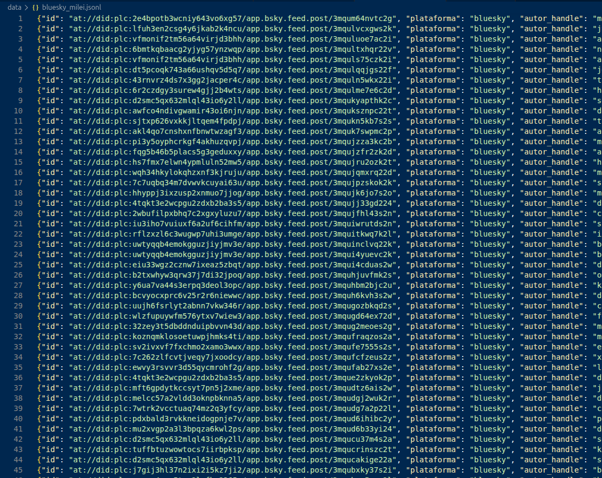

> ² Un post trae mucho más que su texto: el autor, la fecha, a qué post responde o cita, los hashtags, las menciones, los adjuntos (imágenes). Todo eso se normaliza en el JSONL y alimenta después las etapas del género (los adjuntos quedan guardados en una carpeta aparte, "*_media/", y linkeados en el JSONL).

## Paso 2 — Correr el análisis

El comando base es el mismo que en discursos, con dos diferencias: se agrega `--genre tuit` y el input es el JSONL de posts.

```bash
emoparse run --config config.yaml --input data/bluesky_milei.jsonl \
    --genre tuit --run-id bluesky_milei --db runs/bluesky_milei.sqlite \
    --stages <etapas>
```

Como siempre en esta app, conviene ir por bloques y revisar en el dashboard los resultados de cada etapa, en lugar de correr todo de una. El siguiente es un recorrido que funciona bien en la práctica.

**1. Capa tecnolingüística.** Primero, lo propio del dispositivo:

```bash
emoparse run ... --stages technoparse,reframing,emoji_affect,hashtag_semiotics,tecno_usage
```

Esto extrae los tecnolingüísticos (technoparse, se corre sin modelo de IA), analiza el reencuadre de las citas y reposteos con comentario (reframing), resuelve el afecto de los emojis, caracteriza los hashtags y clasifica el uso pragmático de menciones, tecnografismos y links.³ Podés revisar el resultado en las tabs **✳ Tecno** y **#️⃣ Hashtags** del dashboard.

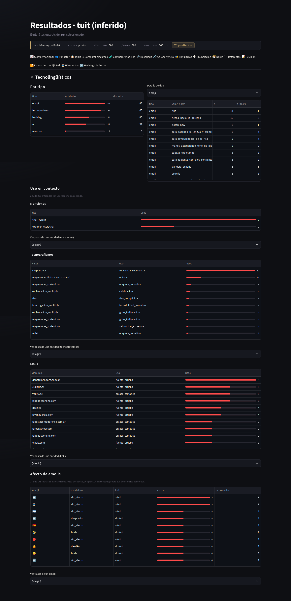

**2. Escena enunciativa.** Ahora el contexto de cada post:

```bash
emoparse run ... --stages metadata,enunciation
```

`metadata` clasifica el tipo de discurso (político, periodístico-informativo, institucional, humor/meme, personal-cotidiano, promocional —podés mirar la caracterización de estos tipos de discurso en [acá](https://github.com/alexdcolman/EmoParse/blob/main/docs/other/tipologia_destinatarios_tuits_fundamentacion.md)—) y `enunciation` (re)construye la escena enunciativa. Revisá la tab **🗣 Enunciación**: como gran parte se resuelve de forma determinista (el enunciador se identifica con la cuenta, el auditorio se completa desde el dispositivo), la revisión es más liviana que la de discursos tradicionales.

**3. Actores y emociones.**

```bash
emoparse run ... --stages actors,emotions,explode_emotions
```

`actors` es opcional (enriquece a `emotions` con los actores discursivos nombrados o inferibles del post, pero `emotions` corre sin ella); si la incluís, va primero. `emotions` detecta las emociones frase por frase de forma aislada, para no contagiar una frase con la anterior. `explode_emotions` separa cada emoción en su propia fila y siembra los primeros vínculos entre marcas y referentes. Mirá los primeros resultados en el dashboard antes de seguir.

**4. Deixis, modalidad y referentes.**

```bash
emoparse run ... --stages deixis,modalidad,normalize_emotions
```

`deixis` resuelve a quién remite cada "yo", "nosotros", "ustedes"; `modalidad` clasifica el tipo de vínculo entre marca y referente; `normalize_emotions` asigna el nombre canónico a cada emoción. Revisá en el dashboard primero **🧭 Deixis** y después **🧩 Referentes**.

Una advertencia propia del género: en tuits, posiblemente, vas a encontrar **mayor dispersión de referentes** que en un discurso político clásico. La brevedad y la multiplicidad de voces generan más variabilidad en cómo se nombra cada entidad ("Milei", "el peluca", "gorda papuda", "@JMilei"). La revisión de deixis y referentes sigue siendo el paso humano más lento: para 500 posts, contá varias horas de trabajo.⁴

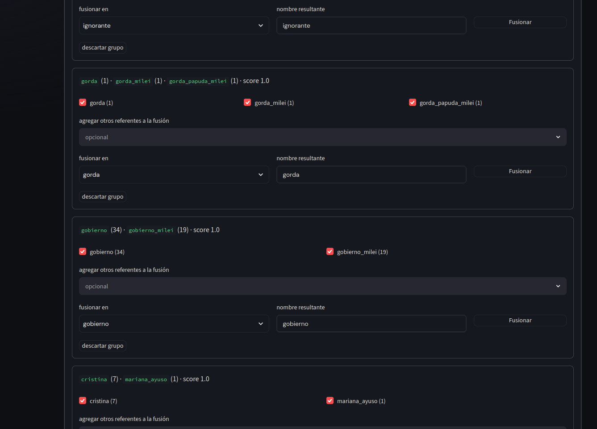

**5. Caracterización fina y auditoría.**

```bash
emoparse run ... --stages characterizer,actants,semas,judge
```

`characterizer` da a cada emoción su perfil (foria, intensidad, dominancia, temporalidad); `actants` suma mediadores, verificadores, operadores de modificación de la emoción y define si la emoción es afirmada o negada; `semas` asigna rasgos semánticos a los referentes ya unificados; `judge` (opcional) audita las inferencias del primer modelo.

```bash
# Ver el progreso en cualquier momento, desde otra terminal:
emoparse status --db runs/bluesky_milei.sqlite
```

> ³ Ejemplos de usos: un hashtag puede ir integrado a la sintaxis o pospuesto como etiqueta; las mayúsculas sostenidas pueden ser grito de indignación, celebración, énfasis neutro o **rótulo temático** ("URGENTE", "NACION"); los puntos suspensivos, reticencia que insinúa o incredulidad; una @mención puede interpelar, confrontar, exponer o citar; una URL puede ser fuente/prueba, autopromoción, convocatoria o enlace temático. Todo esto se resuelve en contexto, post por post.

> ⁴ El trabajo de unificación de referentes está explicado en detalle en el tutorial de discursos; la lógica es idéntica. El dashboard te ofrece fusiones sugeridas (por parecido léxico y, opcionalmente, semántico vía embeddings), pero la fusión final la decidís vos.

## Paso 3 — Explorar los resultados

```bash
emoparse app
```

Se abre el dashboard. Además de las tabs generales (curva emocional, por actor, búsqueda, co-ocurrencia, simulacros, comparación, revisión), el género tuit habilita cuatro tabs propias cuando el run contiene posts:

- **🧵 Hilos** — el árbol conversacional, indentado, con la foria de cada post y las operaciones de reframing (cómo un post reencuadra lo que cita).

  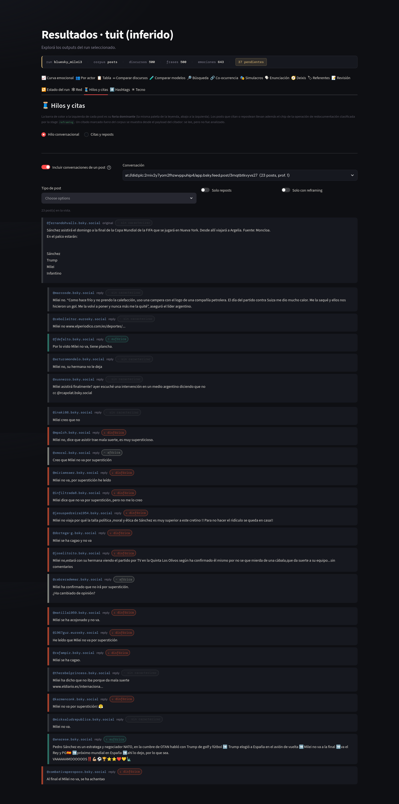

- **#️⃣ Hashtags** — cada hashtag rankeado y coloreado por la foria de su entorno, con la distribución de funciones y drill-down a cada uso.

  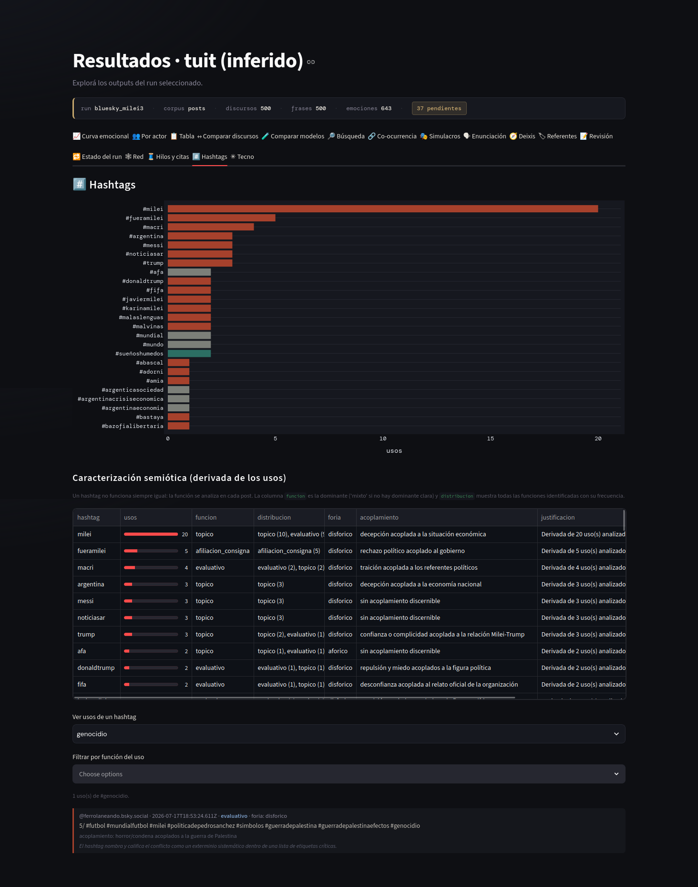

- **✳ Tecno** — la distribución de tecnolingüísticos y el uso en contexto de menciones, tecnografismos y links, más el afecto de cada emoji con las frases donde aparece.

  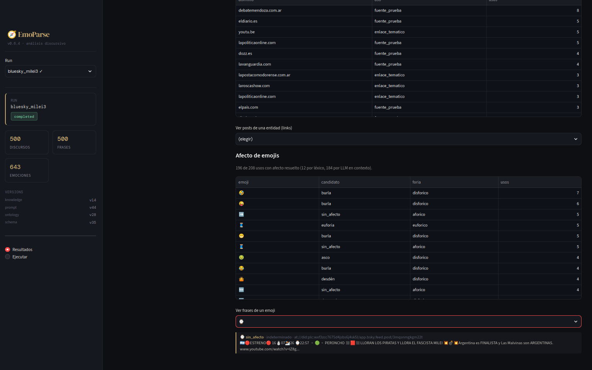

- **🕸 Red** — la red de interacción y de similitud, que tiene su propia sección (abajo).

Además, las tabs generales se adaptan al corpus de posts: la curva emocional se ve por defecto como evolución de la conversación pública (por hashtag o por hilo), la matriz de co-ocurrencia y el timeline se filtran por hilo o hashtag, y la revisión muestra cada post con sus tecnolingüísticos y su media.

  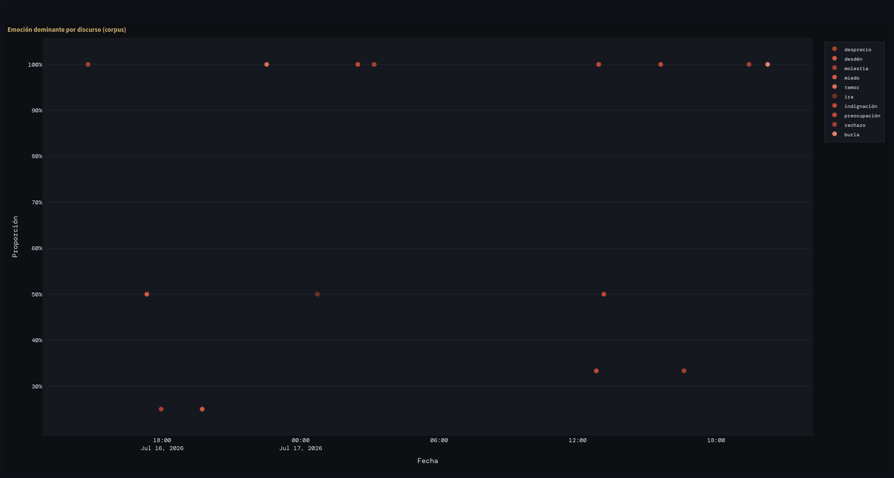
  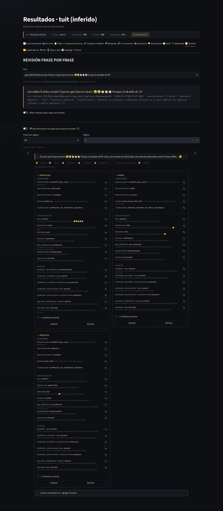

## Paso 4 — Las redes

Para analizar las redes, existen dos comandos.

### Grafo de seguimiento

Quién sigue a quién no está en los posts, sino en la plataforma, así que se adquiere aparte:

```bash
emoparse follows --db runs/bluesky_milei.sqlite --source bluesky
```

EmoParse pide a la plataforma a quién sigue cada cuenta del corpus y conserva los vínculos internos al corpus, dejando el grafo `follow` listo para analizar.⁵ Es una foto del momento de la consulta; se corre una vez, es interruptible y reanudable.

### Análisis de red

```bash
emoparse network --db runs/bluesky_milei.sqlite \
    --semantico --similitud --flujo --cliques
```

Este comando hace varias cosas:

- **Grafos de interacción** (reply, mención, cita, co-hashtag, y `follow` si lo adquiriste): calcula quién está en el centro de la conversación (PageRank, grados) y qué comunidades de cuentas se forman (Louvain). Con `--cliques`, además, los grupos donde todas las cuentas se vinculan recíprocamente entre sí.
- **Circulación emocional** (`--flujo`): mide el **contagio por tipo de emoción** —un valor de *lift* mayor que 1 indica que un tipo de emoción se replica en las respuestas más de lo que su frecuencia haría esperar; por ejemplo, en el corpus de prueba, el desprecio y la indignación mostraron los lifts más altos— y la transición fórica partida en **intra e inter comunidad** (¿la disforia escala puertas adentro de una burbuja, o en el cruce entre comunidades?).
- **Agrupamiento narrativo** (`--similitud`): agrupa los **simulacros emocionales** que se parecen entre sí —mismo experienciador, mismo tipo de emoción, misma fuente, etc.—. Podés elegir qué componentes se tienen en cuenta.
- **Agrupamiento semántico** (`--semantico`): agrupa los posts por contenido, vía embeddings.

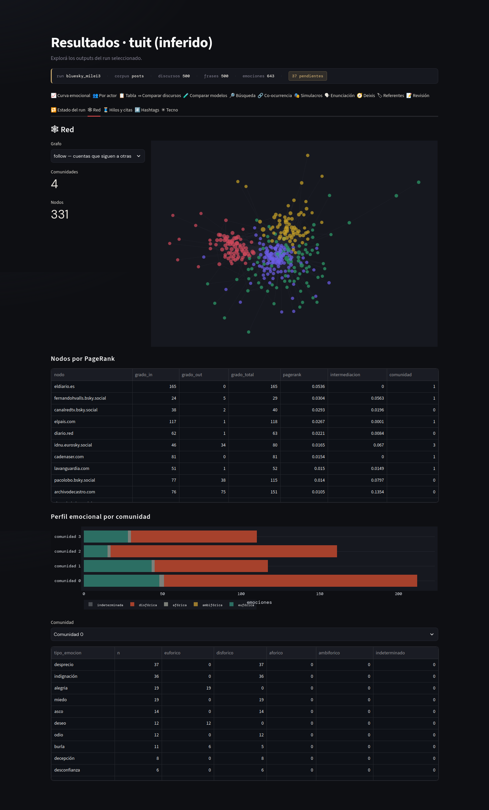

Todo esto se explora en la tab **🕸 Red**, y con `--export-dir` se exporta a GEXF (para abrir en Gephi) y CSV.

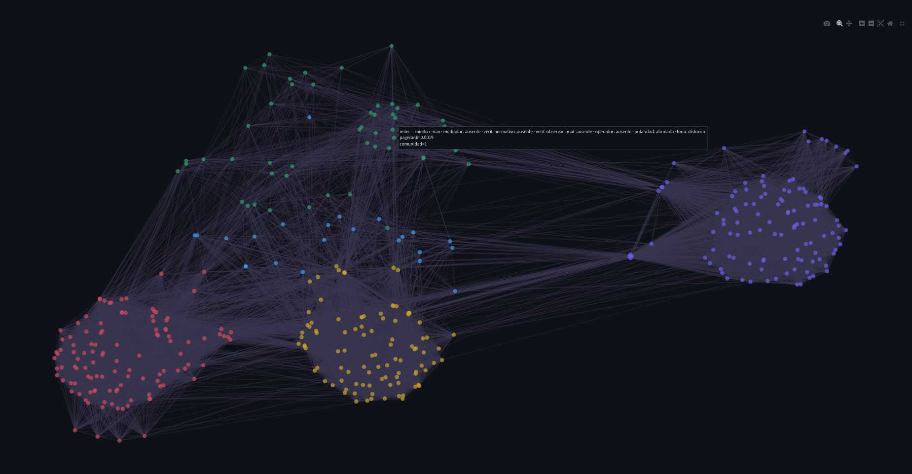

> ⁵ Solo se consulta el lado saliente (a quién sigue cada cuenta), no los seguidores: la arista A→B se captura igual desde la lista de A, y una cuenta sigue a cientos pero puede tener cientos de miles de seguidores. Si tu corpus está seudonimizado, el comando necesita los handles reales en un archivo (`--handles`) y la misma sal (`--salt`), porque el alias es un hash que no se puede consultar en la plataforma.

## Paso 5 — Armar los comandos desde el dashboard

Si te resulta incómodo recordar los comandos que tenés que ejecutar, el dashboard tiene una sección, llamada **⚙ Ejecutar**, que los arma por vos: elegís el comando que necesitás y las opciones con controles, y te muestra la línea lista para copiar y pegar en la terminal.

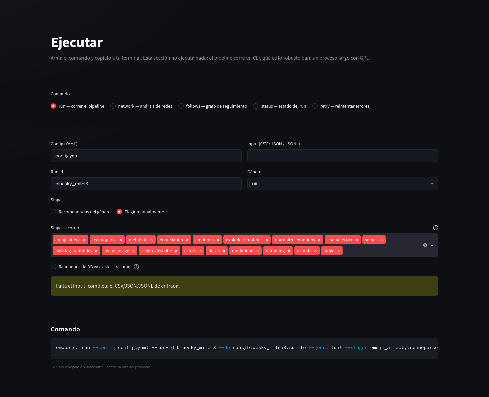

## Preguntas frecuentes

**¿Puedo mezclar posts de Bluesky, Mastodon y X en un mismo corpus?** Sí: `emoparse acquire` normaliza todas las fuentes al mismo formato. Tené en cuenta igual que la estructura de hilos y de seguimiento puede estar más completa en unas plataformas que en otras.

**¿La revisión de tuits es más rápida que la de discursos?** La de la escena enunciativa, sí: gran parte se resuelve de forma determinista desde el dispositivo. La de referentes, no necesariamente: la dispersión de nombres propia del género puede darte más casi-duplicados que unificar.

**¿El análisis de redes necesita GPU?** No. Los comandos `follows` y `network` no usan modelos de lenguaje (salvo el agrupamiento semántico, que usa un modelo de embeddings liviano). El costo está en las consultas a la plataforma para `follows`, no en cómputo local.

**¿Necesito posts para usar la tab Red?** Para los grafos de interacción, sí. Pero los dos agrupamientos de similitud (narrativo y semántico) valen para cualquier género: si analizás discursos, también podés correr `emoparse network --similitud --semantico` y explorar el resultado en la tab Red.

**¿Qué emociones reconoce en tuits que no reconoce en discursos?** La ontología suma emociones frecuentes en el discurso político en redes —burla, hartazgo, cringe (vergüenza ajena), diversión— restringidas al género sobre una base compartida.
